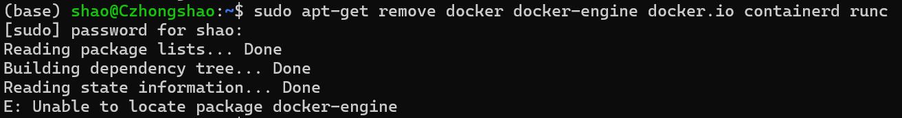
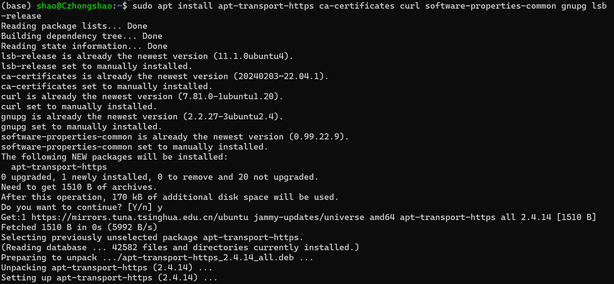
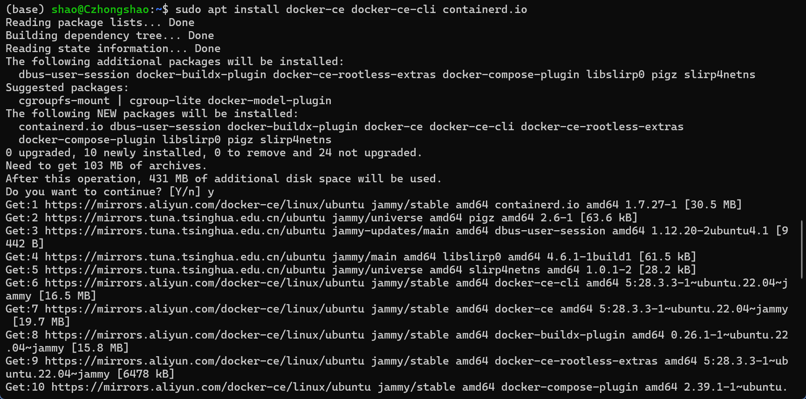
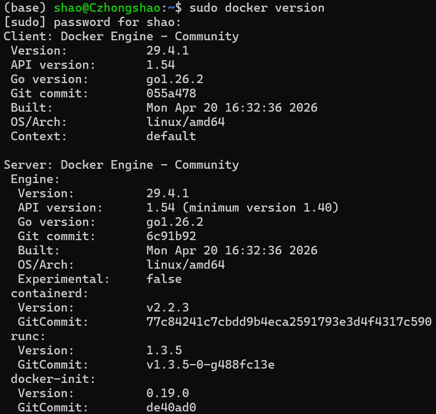
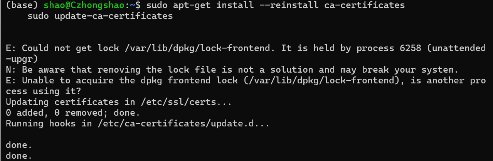
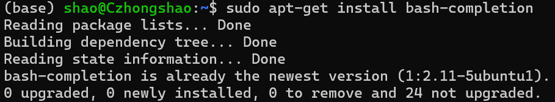
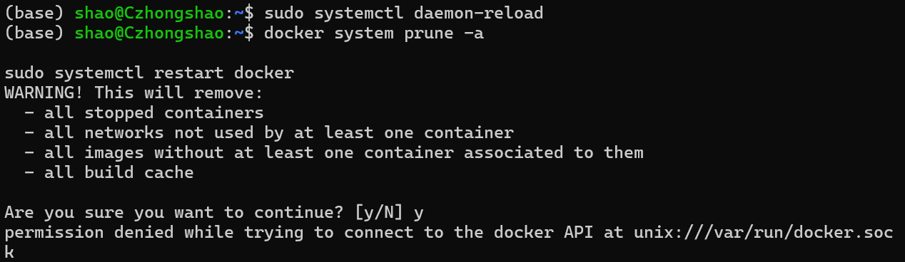
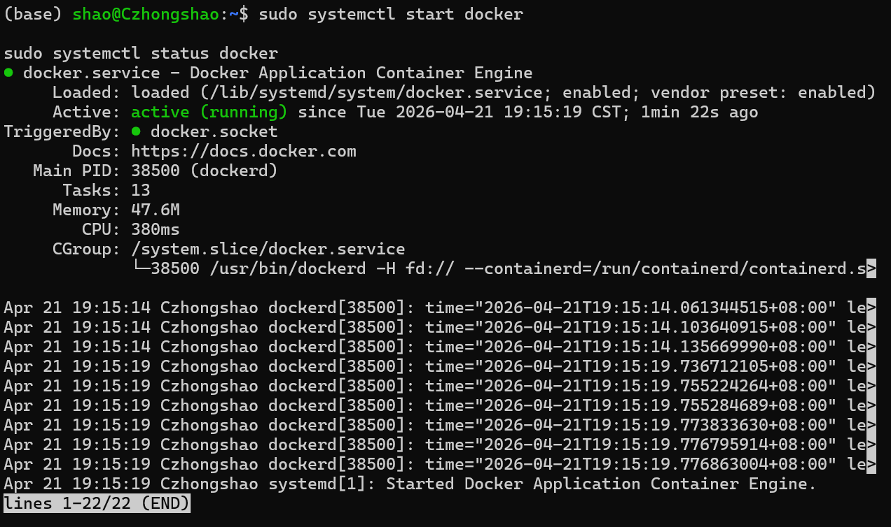
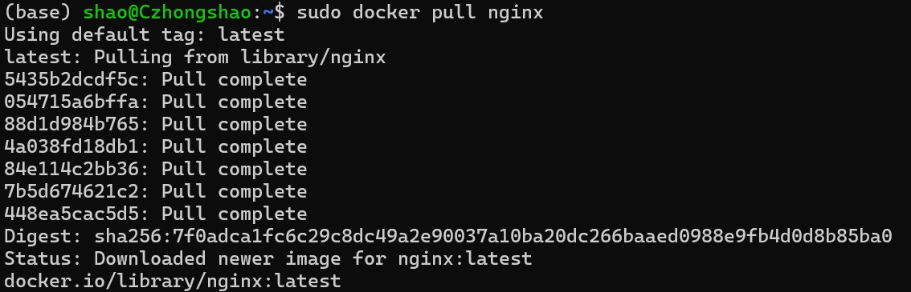

# 基于Ubuntu22.04安装Docker

## 一、准备阶段

### 1. 卸载Ubuntu可能自带的docker

```bash
sudo apt-get remove docker docker-engine docker.io containerd runc
```



### 2. 安装依赖

```bash
sudo apt install apt-transport-https ca-certificates curl software-properties-common gnupg lsb-release
```



### 3. 添加 Docker GPG 密钥

1. **Docker 官方 key**

    ```bash
    curl -fsSL https://download.docker.com/linux/ubuntu/gpg | sudo gpg --dearmor -o /usr/share/keyrings/docker-archive-keyring.gpg
    ```

2. **阿里源 key**（推荐）

    ```bash
    curl -fsSL https://mirrors.aliyun.com/docker-ce/linux/ubuntu/gpg | sudo gpg --dearmor -o /usr/share/keyrings/docker-archive-keyring.gpg
    ```

### 4. 设置稳定版仓库

1. **Docker 官方源**

    ```bash
    echo "deb [arch=$(dpkg --print-architecture) signed-by=/usr/share/keyrings/docker-archive-keyring.gpg] https://download.docker.com/linux/ubuntu $(lsb_release -cs) stable" | sudo tee /etc/apt/sources.list.d/docker.list > /dev/null
    ```

2. **阿里源**（推荐）

    ```bash
    echo "deb [arch=$(dpkg --print-architecture) signed-by=/usr/share/keyrings/docker-archive-keyring.gpg] https://mirrors.aliyun.com/docker-ce/linux/ubuntu $(lsb_release -cs) stable" | sudo tee /etc/apt/sources.list.d/docker.list > /dev/null
    ```

## 二、安装 Docker

### 1. 安装最新版本docker

```bash
sudo apt update

sudo apt install docker-ce docker-ce-cli containerd.io
```



### 2. 查看 Docker 版本

```bash
sudo docker version
```



### 3. 安装 Docker 命令补全工具

1. 更新 CA 证书（可选，若下方出现SSL证书认证问题，可加 `-k`）

    ```bash
    sudo apt-get install --reinstall ca-certificates
    sudo update-ca-certificates
    ```

    

2. 安装工具

    ```bash
    sudo apt-get install bash-completion

    sudo curl -k -L https://raw.githubusercontent.com/docker/docker-ce/master/components/cli/contrib/completion/bash/docker -o /etc/bash_completion.d/docker.sh

    source /etc/bash_completion.d/docker.sh
    ```

    
    

### 4. 允许非 root 用户执行 docker 命令

- 在docker命令前加上sudo，比如：`sudo docker ps`
- `sudo -i` 切换至 root 用户，再执行 docker 命令

### 5. 添加 Docker 镜像站

```bash
sudo vim /etc/docker/daemon.json
```

修改配置文件，添加下面内容：

```txt
{
    "registry-mirrors": 
    [
        "https://docker.m.daocloud.io",
        "https://noohub.ru",
        "https://huecker.io",
        "https://dockerhub.timeweb.cloud",
        "https://docker.rainbond.cc"
    ]
}
```

重启 Docker 以生效

```bash
sudo systemctl daemon-reload

docker system prune -a

sudo systemctl restart docker
```



### 5. 启动并查看 Docker 运行状态

```bash
sudo systemctl start docker

sudo systemctl status docker
```



### 6. 测试拉取镜像

```bash
sudo docker pull nginx
```



## 三、Docker 常用命令速查表

| 命令                            | 作用               | 示例                                            |
| ------------------------------- | ------------------ | ----------------------------------------------- |
| `docker pull nginx`             | 拉取镜像           | 从仓库下载 nginx 镜像                           |
| `docker images`                 | 列出本地镜像       | 查看已下载的所有镜像                            |
| `docker rmi nginx`              | 删除镜像           | 删除名为 nginx 的镜像                           |
| `docker run -d -p 80:80 nginx`  | 运行容器           | 后台运行 nginx，映射主机80端口到容器80端口      |
| `docker ps`                     | 查看运行中的容器   | 列出当前正在运行的容器                          |
| `docker ps -a`                  | 查看所有容器       | 包括已停止的容器                                |
| `docker start <容器ID>`         | 启动容器           | 启动一个已停止的容器                            |
| `docker stop <容器ID>`          | 停止容器           | 优雅停止运行中的容器                            |
| `docker restart <容器ID>`       | 重启容器           | 重启指定容器                                    |
| `docker rm <容器ID>`            | 删除容器           | 删除一个已停止的容器                            |
| `docker exec -it <容器ID> bash` | 进入容器内部       | 以交互方式进入容器执行命令                      |
| `docker logs <容器ID>`          | 查看容器日志       | 查看容器的标准输出日志                          |
| `docker build -t myapp .`       | 构建镜像           | 使用当前目录的 Dockerfile 构建名为 myapp 的镜像 |
| `docker tag nginx mynginx:v1`   | 给镜像打标签       | 为 nginx 镜像创建新标签                         |
| `docker push mynginx:v1`        | 推送镜像到仓库     | 将镜像推送到远程仓库                            |
| `docker-compose up -d`          | 启动编排服务       | 后台启动 docker-compose.yml 中定义的所有服务    |
| `docker-compose down`           | 停止并移除编排服务 | 停止并删除 compose 创建的所有容器和网络         |
| `docker volume ls`              | 列出数据卷         | 查看所有 Docker 数据卷                          |
| `docker network ls`             | 列出网络           | 查看所有 Docker 网络                            |
| `docker system df`              | 查看磁盘占用       | 显示镜像、容器、数据卷的磁盘使用情况            |
| `docker system prune`           | 清理无用数据       | 删除所有未使用的容器、网络、镜像（慎用）        |
