# 大数据智慧树原题
**考题全部出自智慧树作业部分。**
**下面是具体的题型划分，以及在题库中的占比情况。** 

*题数/题库总数 x 分值* 
- 单选：20/60 x 2 = 40
- 多选：5/20 x 4 = 20
- 简答：2/5 x 10 = 20
- 论述：20（大作业）【涉及通用/个人分工如何完成，需要考虑 Hadoop 集群在作业中的应用】

---

# 一、 单选题
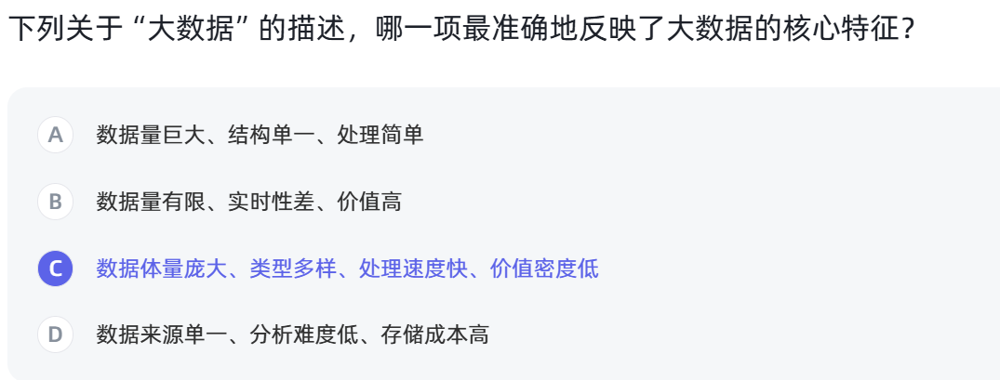

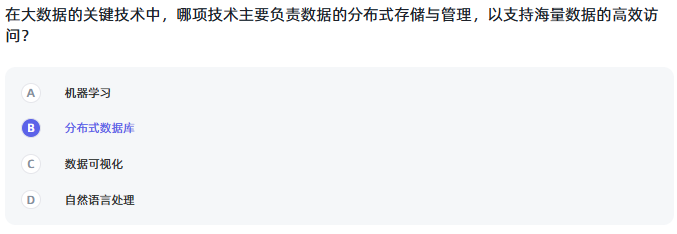
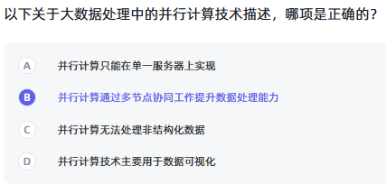
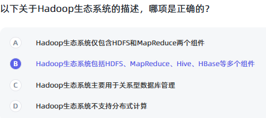
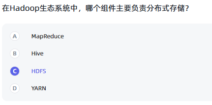
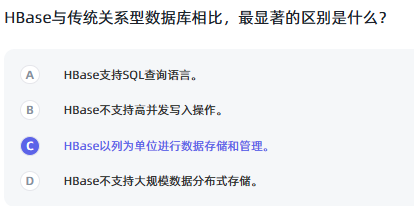
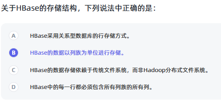
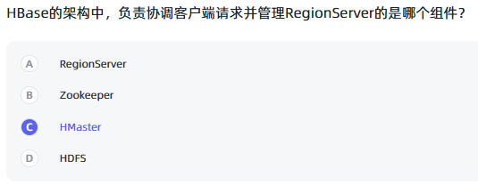
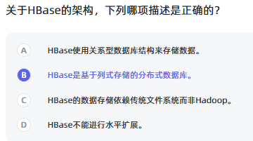
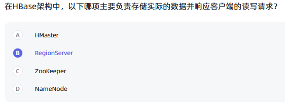
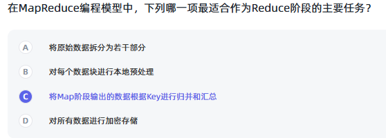
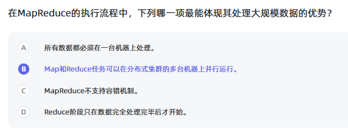
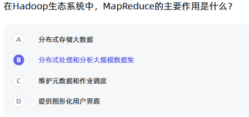
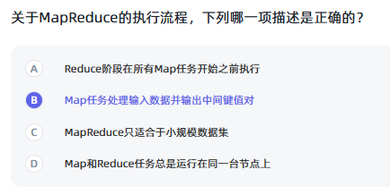
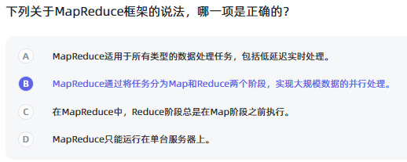
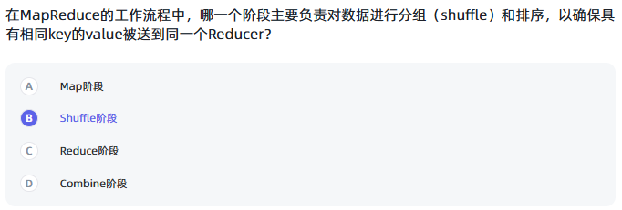
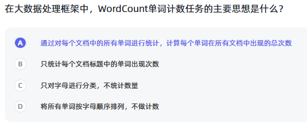
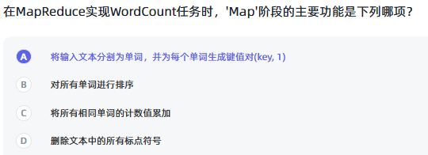
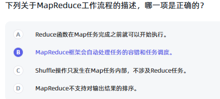
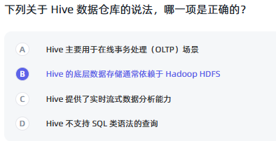
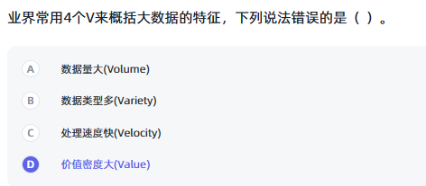
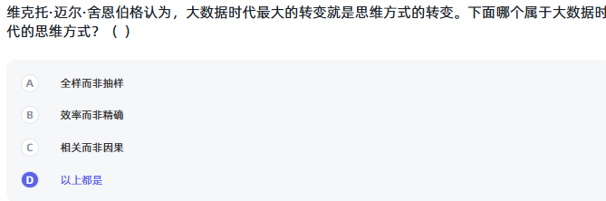
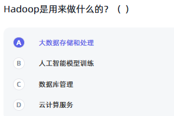
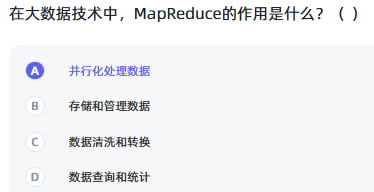
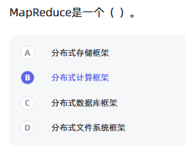

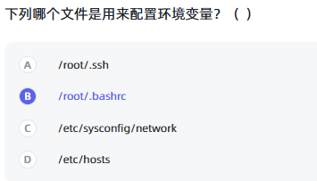
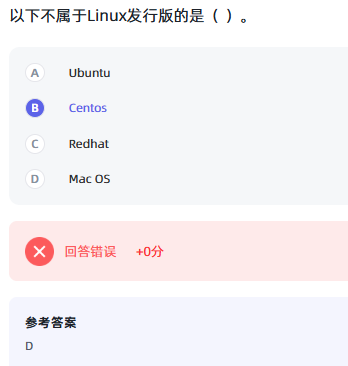

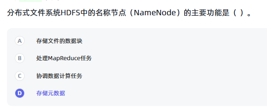
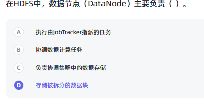

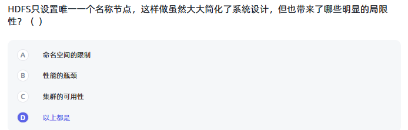
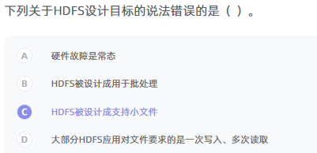
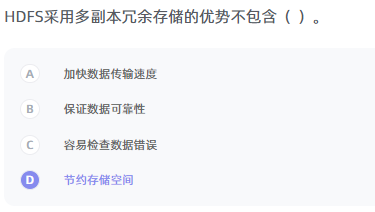
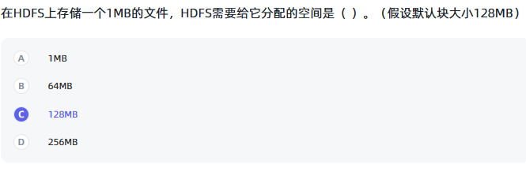
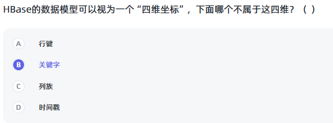
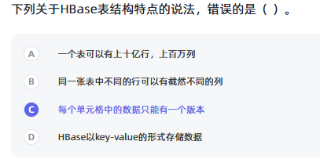

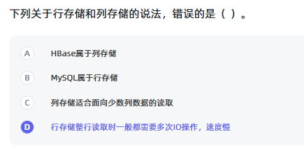
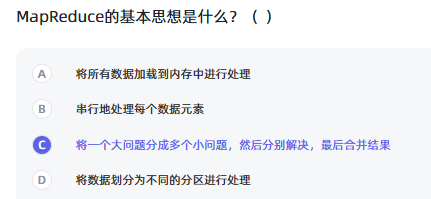
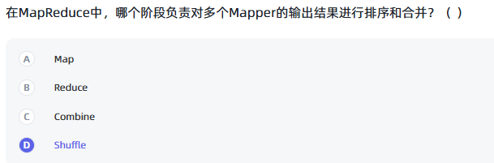
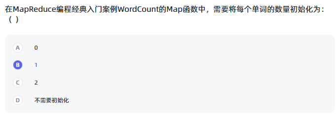
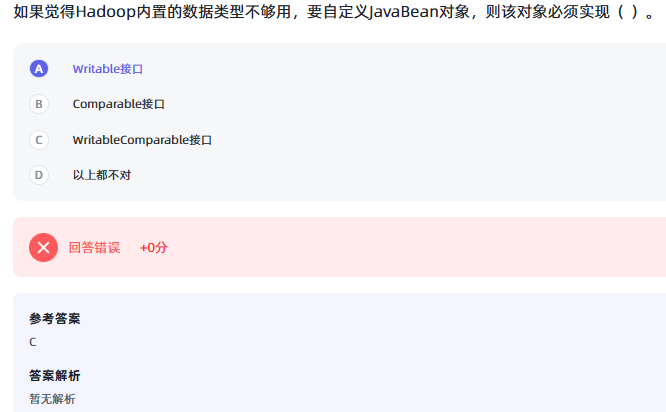

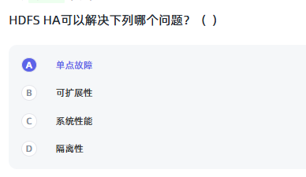
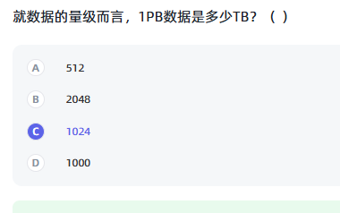
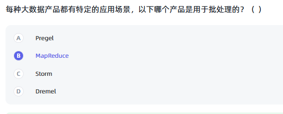

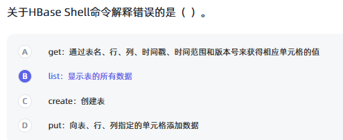
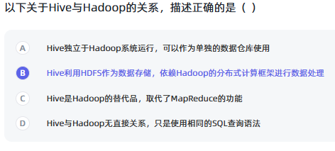
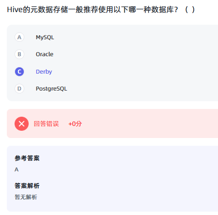

# 二、 多选题
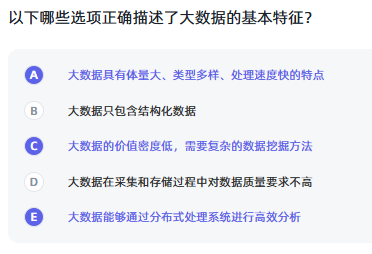
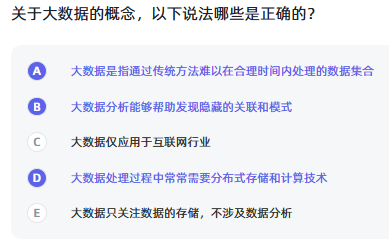
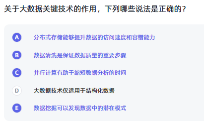
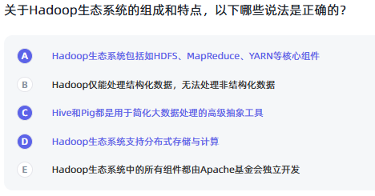

# 三、 判断题（未说明考点）
✅❎

# 四、 简答题

