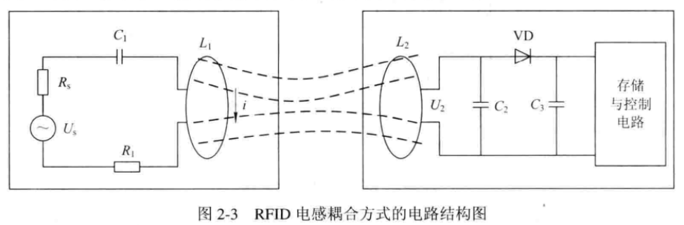

# 《无线射频识别技术与应用》期末考试大纲

## 1. RFID系统标签的分类（按供电方式）

### 1.1. 无源标签（被动标签，Passive Tag）
- **供电方式**：无内置电池，从读卡器发出的射频能量中提取电能
- **特点**：
  - 读写距离近
  - 价格低
  - 使用寿命几乎无限制
  - 需要大功率的读写装置

### 1.2. 半无源标签（Semi-passive Tag）
- **供电方式**：内置电池，但电池仅对标签内要求供电维持数据的电路或芯片工作所需的电压作辅助支持
- **特点**：
  - 结合有源RFID和无源RFID的优势
  - 在 125 kHz频率触发下，使微波 2.45 GHz的优势发挥出来
  - 也叫低频激活触发技术
  - 利用低频近距离精确定位、微波远距离识别和上传数据

### 1.3. 有源标签（主动标签，Active Tag）
- **供电方式**：工作电源完全由内部电池供给
- **特点**：
  - 具有持久性、信息传播穿透性强、存储信息容量大、种类多等特点
  - 可提供更远的读写距离
  - 成本更高
  - 使用寿命有限
  - 对读写装置的依赖小
  - 适用于远距离读写的应用场合

---

## 2. RFID按应用频率分类

### 2.1. 低频（LF）：30 kHz ~ 1 MHz
- **典型工作频率**：125 kHz、133 kHz
- **通信距离**：1 cm ~ 1.5 cm
- **耦合方式**：电磁耦合
- **应用领域**：动物追踪、门禁、汽车防盗、POS
- **特点**：一般为无源标签，工作能量通过电感耦合方式从读卡器耦合线圈的辐射近场中获得

### 2.2. 高频（HF）：3 MHz ~ 30 MHz
- **典型工作频率**：13.56 MHz
- **通信距离**：1 cm ~ 0.7 m
- **耦合方式**：电磁耦合
- **应用领域**：智能卡、行李管理、供应链之物品管理、汽车生产管理、LCD/PDP生产、卖场
- **特点**：工作原理与低频标签完全相同，也归为低频标签类中

### 2.3. 超高频（UHF）：300 MHz ~ 1000 MHz
- **通信距离**：1 m ~ 3 m
- **耦合方式**：电磁发射原理
- **应用领域**：供应链之栈板/纸箱管理、电子收费及行李管理

### 2.4. 微波（MW）：2.4 GHz 或 5.8 GHz
- **通信距离**：1 m ~ 10 m
- **耦合方式**：电磁发射原理
- **应用领域**：供应链之栈板/纸箱管理、电子收费及行李管理

---

## 3. RFID耦合方式

### 3.1. 电感耦合方式
- **别称**：近场工作方式
- **适用频率**：13.56 MHz 和小于 135 kHz 的频段
- **工作距离**：一般在 1 m 以下，典型作用距离为 10 cm ~ 20 cm
- **特点**：
  - 电子标签几乎都是无源的
  - 能量从读卡器所发送的电磁波中获取
  - 效率不高，主要适用于小电流电路
  - 读卡器向电子标签的数据传输通常采用幅移键控（ASK）调制方式
  - 电子标签向读卡器的数据传输采用负载调制的方法（实质是振幅调制AM）

### 3.2. 反向散射耦合
- **别称**：远场工作方式
- **适用频率**：超高频（UHF）和微波（SHF），电子标签和读卡器的距离大于 1 m
- **典型工作距离**：3 m ~ 10 m
- **原理**：利用雷达原理模型，发射出去的电磁波碰到目标后反射，同时携带回目标信息，依据的是电磁波的空间传播规律
- **适用场景**：高频、微波工作的远距离射频识别系统中

### 3.3. 电感耦合方式的电路结构
- **读卡器端**：$U_S$ 是射频源，$L_1$、$C_1$ 构成谐振回路，$R_S$ 是射频源的内阻，$R_1$ 是电感线圈 $L_1$ 的损耗电阻
- **标签端**：$L_2$ 是电子标签电感线圈，$C_2$、$C_3$ 是电容，VD是二极管
- **工作原理**：
  - $U_S$ 在 $L_1$ 上产生高频电流 $i$，在谐振时电流 $i$ 最大
  - 高频电流 $i$ 产生的磁场穿过线圈，并有部分磁力线穿过电子标签电感线圈 $L_2$
  - 穿过电感线圈 $L_2$ 的磁力线通过电磁感应，在 $L_2$ 上产生电压 $U_2$
  - 将 $U_2$ 整流后就可以产生电子标签工作所需要的直流电压
  - 电容 $C_2$ 的选择应使 $L_2$、$C_2$ 构成对工作频率谐振的回路，以使电压 $U_2$ 达到最大值

---

## 4. RFID面临的问题

### 4.1. 成本问题
- 射频识别中芯片的成本以及整个信息系统更新换代所引发的巨大的投资成本
- 目前美国一个电子标签的价格在20美分左右，需降低到4美分以下才能适用于单件产品
- RFID读卡器的价格目前大都在1000美元以上
- 需要通过技术改进和大规模的生产才能降低成本

### 4.2. 安全问题
- RFID技术对个人隐私安全的威胁极大地阻碍了它的快速推广
- 目前常用的RFID技术都是无源的，没有读写能力，无法使用各种验证口令及密码等主动验证方法
- 读卡器中唯一的标识符很容易被复制
- 如果使用有源标签并且不断变换验证密钥就可以大大提高安全性，但同时也导致成本的大幅度提高

### 4.3. 标准问题
- 当前世界上主要存在着两套射频识别标准：
  - 日本制定的128位编码及专用协议
  - Auto-ID Center提出的96位电子产品编码和专用协议
- 这两套标准不统一，严重制约着物联网这一跨地区、跨国家的全球统一网络的构建
- 在中国，RFID技术的生产和应用领域仅有一些行业标准，还没有相应的国家标准

### 4.4. 辐射问题
- RFID技术所使用的是800 MHz ~ 900 MHz的高频电磁波
- 随着它的应用范围不断扩大，人们将会生活在高频电磁场中，这将是另一种形式的污染
- 需要尽可能地降低辐射强度并将其控制在对人安全的范围内

### 4.5. 多样性和复杂性
- 由于用户需求的多样性和复杂性，导致很多RFID应用只是在探索阶段
- 使公司的研发压力和成本加大
- 可通过改进工艺和技术创新降低成本，使之能够与传统的条形码相比

---

## 5. RFID标准体系

### 5.1. ISO标准
- 与ISO有关的所有合作组织都做了各种射频相关的标准
- 如ISO、电子标签、EPC global和EPC global目前都是提供射频相关的性能规范

### 5.2. EPC Global
- 与ISO标准不同，EPC global是商业性质和自愿性规范
- 可以看作是一种标准，EPC global目前提供射频相关的性能规范
- EPC global制定了EPC global的EPC编码标准，它还可以对现有物品提供唯一标记
- EPC global制定了EPC global的EPC编码标准，这可以说是EPC global的核心

### 5.3. UID
- UID是日本制定的一个标准，与EPC global类似，但是UID标准是一个开放的标准
- 是从编码体系、空中接口协议到后台网络体系，是一个完整的体系
- 在RFID标准方面，UID与EPC global和ISO的标准相比，并且采取与ISO的相关标准兼容的策略

### 5.4. AIM Global
- 是自动识别和数据采集技术的国际性组织
- 于1999年9月成立了AIM Automatic Identification and Data Collection International

### 5.5. IP-X
- 是IP-X，是日本、美国、日本等国的射频识别标准，其标准主要在日本等国家实行

---

## 6. RFID系统的安全与隐私

### 6.1. 目前主要面临的安全与隐私威胁
- **信息泄露**：如在RFID图书馆、药品、电子档案、生物特征等系统中
- **恶意追踪**：RFID系统后端服务器提供数据库，电子标签只需传递简单的标识符，可以通过电子标签固定的标识符追踪电子标签，即使电子标签进行加密后也可以对不知内容的加密信息进行追踪

### 6.2. RFID系统面临的攻击手段

#### （一） 主动攻击
- 首先获得电子标签的实体，通过物理手段在实验室环境中去除芯片封装，使用微探针获取敏感信号，进行目标标签的重构
- 然后利用微处理器的通用接口，扫描电子标签和响应读卡器的探寻，寻求安全协议加密算法及其实现弱点，从而删除或篡改电子标签内容
- 最后通过干扰广播、阻塞信道或其他手段，产生异常的应用环境，使合法处理器产生故障、拒绝服务器攻击等

#### （二） 被动攻击
- 采用窃听技术，分析微处理器正常工作过程中产生的各种电磁特征，获得电子标签和读卡器之间的通信数据
- 美国某大学教授和学生利用定向天线和数字示波器监控电子标签被读取时的功率消耗，通过监控电子标签的能耗过程从而推导出了密码
- 根据功率消耗模式可以确定何时电子标签接收到了正确或者不正确的密码位

### 6.3. RFID的安全与隐私性能

#### （一） 数据秘密性的问题
- 一个电子标签不应向未授权的读卡器泄露信息
- 目前，读卡器和电子标签之间的无线通信在多数情况下是不受保护的（除采用ISO 14443标准的高端系统）
- 由于缺乏支持点对点加密和PKI密钥交换的功能，因此攻击者可以获得电子标签数据，或采取窃听技术并分析微处理器正常工作中产生的各种电磁特征来获得通信数据

#### （二） 数据完整性的问题
- 保证接收的信息在传输过程中没有被攻击者篡改或替换
- 数据完整性一般是通过数字签名完成的
- 通常使用消息认证码进行数据完整性的检验，采用带有共享密钥的散列算法，将共享密钥和待检验的消息连接在一起进行散列运算

#### （三） 数据真实性的问题
- 即电子标签的身份认证问题
- 攻击者从窃听到的通信数据中获取敏感信息，重构电子标签进行非法使用，如伪造、替换、物品转移等

#### （四） 用户隐私泄露问题
- 一个安全的RFID系统应当能够保护使用者的隐私信息或相关经济实体的商业利益

---

## 7. RFID应用

### 7.1. RFID在医药产品中的应用

#### （一） RFID在医药物流中的应用意义
- 我国的医药物流发展尚处于起步阶段，存在的问题也比较多
- 全国有12 000家左右的医药生产及批发企业，其中年销售不足1 000万元的小规模企业占78.5%以上
- 由于物流量小，多数药品采取邮寄、铁路托运，运输周期长，运输环境、条件差，导致药品损坏、变质、污染严重
- 一项研究数据表明，不合格药品中17.03%是药品运输、搬运过程中造成的

#### （二） 医药产品供应链技术EPC应用
- 产品的编码标准是非常基础的工作，尤其对医药产品的生产和物流具有十分重要的意义
- 但从其实施需要较高成本和经济实力
- 发达国家多年来投入大量的人力和物力，努力进行医学信息标准化的工作，取得了令人瞩目的成绩，而且许多标准已经被广泛应用，如国家药品编码（National Drug Codes，NDC）就是其中的优秀代表
- NDC是被美国医药局管理要求使用的标准药品编码，它包括了药品的各种细节，包括包装要求

#### （三） RFID技术在医药物流上的具体应用
- 目前大部分医药企业应用的EPC（企业资源规划）和SCM（供应链管理）系统来说，RFID是一种革命性的突破，它的精细化管理将触角伸到了企业经营活动的每一个环节，使生产、存储、运输、分销、零售等方方面面管理都变得很便利
- 过去的物品编码无法实现对单一部件的跟踪，而由于采用EPC编码的电子标签的存储容量是 $2^{96}$ bit上，因此可以对世界上所有的商品都唯一的代码表示
- RFID技术将彻底改变制药行业的局限性，使所有的商品都可以享受这一识别

#### （四） RFID技术在医药商品应用中的改进
- 建立基于RFID技术的医药商品安全监督管理中心
- 促进和完善RFID技术在医药产品管理领域的应用，研发核心技术在自主RFID设计、天线设计、编码技术等方面，集中攻关，在稳定的国际服务供应商或拥有自主知识产权的医药产品生产线等方面得到全面的解决方案
- 国家政策和财政上加大支持力度，促进各种相关技术及产品的研发和生产，尤其加强教育和科研领域的投入

---

## 8. 复习建议

1. **重点掌握**：三种标签类型的特点和区别
2. **重点掌握**：四种频率范围及其应用领域
3. **重点掌握**：两种耦合方式的原理和适用场景
4. **理解记忆**：电感耦合电路结构和工作原理
5. **理解记忆**：RFID面临的五大问题及其解决方案
6. **重点掌握**：RFID系统的安全威胁和攻击手段
7. **理解记忆**：RFID标准体系（ISO、EPC Global、UID等）
8. **了解**：RFID在医药物流中的应用

---

**说明**：此大纲基于重点页面（P5、P9、P13、P16、P17、P18、P26、P27、P34、P38、P39、P62）整理，可能会包含不考的部分，请结合课堂笔记和教材进行复习。
