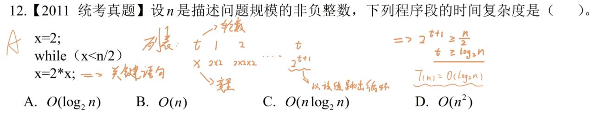
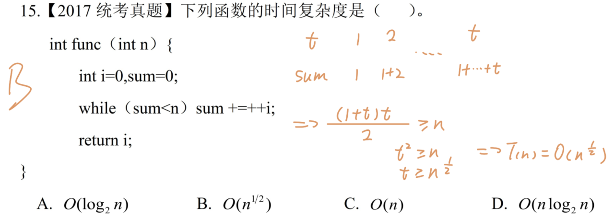
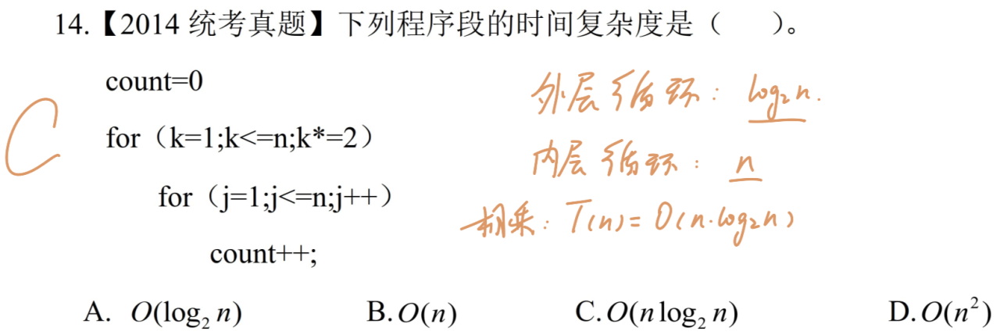
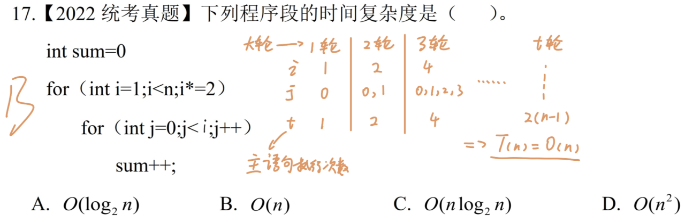
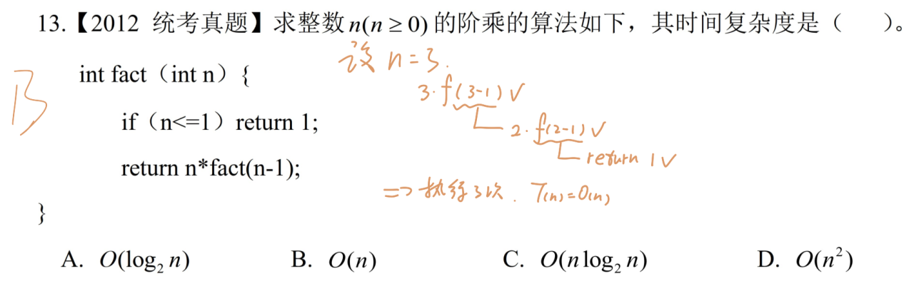
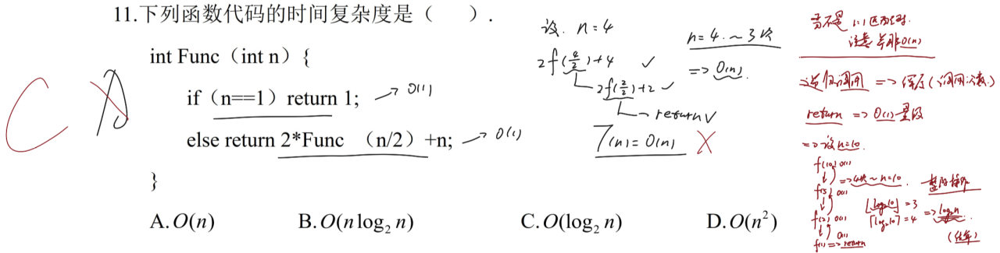

# 一、 单层循环

> **关键点**：列表处理每轮关键语句执行次数与轮数的关系。
> 
> 系数可以省略不写。

> **关键点**：列表，找出变量与循环轮次的关系。最好写出其完整的表达式，找出规律。
> 
> 根据时间复杂度的要求，只取最高次数，其余均省略。

---

# 二、 双层循环

## 2.1. 内外循环均与 n 相关

> **关键点**：内循环和外循环可以看作是两个 **独立** 的循环语句，分别求得内外循环的时间复杂度。
> 
> 根据两个循环共同作用，整个程序的时间复杂度取二者的乘积。

## 2.2. 内循环由外循环控制

> **关键点**：将内外循环限定在每一个大循环中，依次求出主语句的执行次数，进而得到大循环轮次和主语句执行次数之间的关系。
> 
> 每一个大轮的各个参数的取值需要足够细致，目的是为了得到准确的逐语句执行次数。

---

# 三、 递归调用

> **关键点**：找到关键语句，并设定一个初始值，计算递归调用的执行次数。
> 
> `return 1;` 与 `return n*fact(n-1)` 执行一次都消耗常量级时间 `O(1)`。

> **关键点**：看上去近似 `1: 1` 实际上是一个陷阱，需要适当扩大设立的初始值，进而找到关系式。
> 
> 这里 `return 1;` 与 `2*Func(n/2)+n` 均是 `O(1)` 量级。递归调用的本质是深度，即*调用次数*。