# 一、 顺序查找与折半查找

## 1.1. 基本概念

> **注意点**：顺序查找这个顺序是从一端至另一端的过程。
> 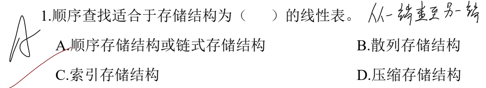
> 线性表有顺序结构的是顺序存储和链式存储两种，都是从一端到另一端的可遍历序列。

> **注意点**：折半查找和顺序查找的时间复杂度均是 O(n) 级。
> 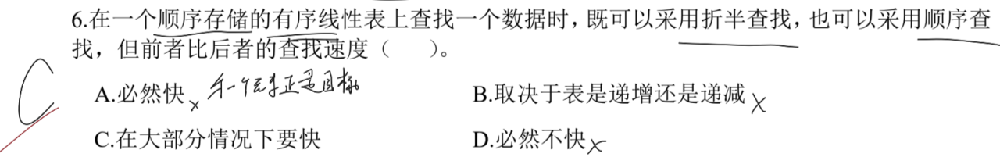
> 如果目标元素在顺序存储的第一个位置，此时折半查找是不如顺序查找快的。
> 对于表的递增还是递减，这对二者均无影响，只要是有序序列，折半查找和顺序查找效率相近。
> 所以说折半查找大多情况下会比顺序查找效率要高。

> **注意点**：折半查找适用于顺序存储的线性表。
> 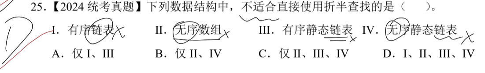
> 这里的Ⅰ、Ⅲ、Ⅳ都是链表，无论链表是否有序，都不适用于折半查找。
> 而Ⅱ的存储结构适合，但是折半查找需要的是有序序列，这里无序也不适用。

---

## 1.2. 平均查找长度

平均查找长度分为 **成功** 和 **失败** 两种。
成功的平均查找长度 = 成功结点所在判定树中层数的总和 / 总结点数
$$
ASL_{成功} = \frac{1\times N_1 + 2 \times N_2 + \cdots + h \times N_n}{N_1 + N_2 + \cdots + N_n} 
$$

失败的平均查找长度 = 失败结点(外部结点)所在判定树的上一层的总和 / 总失败结点数
换句话说：**失败的平均查找长度** 的实际比较次数只需要比较到其父结点，若是发现到失败结点时，就不需要比较了，就算已经失配。
因为往下失败结点所代表含义是代表一个区间范围。

> **注意点**：关键字 12 个，优先构造一个折半查找判定树。
> 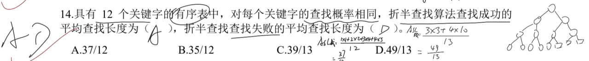
> $ASL_{成功} = \frac{1 \times 1 + 2 \times 2 + 3 \times 4 + 4 \times 5}{12} = \frac{37}{12}$ 
> $ASL_{失败} = \frac{3 \times 3 + 4 \times 10}{13} = \frac{49}{13}$ 
> 注意这里失败的计算高度是按其父结点的高度来算的，**根本原因就是失败结点并没有真正用于比较。**

> **注意点**：分块查找在如果规定块间和块内均是顺序查找，此时的平均查找长度需要分别计算块间和块内的 ASL，然后将二者相加即为结果。
> 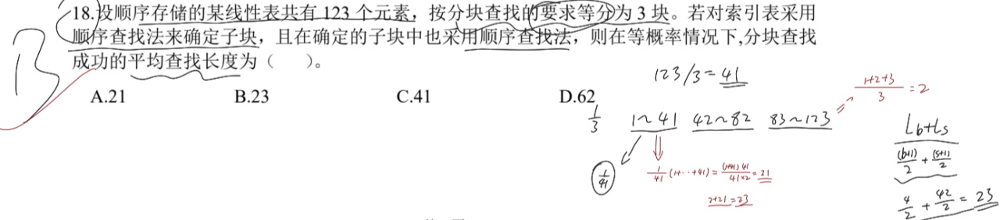
> 此题将 123 个元素均分为 3 块，每块 41 个元素。
> 块间的 $ASL_{成功} = \frac{1 + 2 + 3}{3} = 2$；块内的 $ASL_{成功} = \frac{1 + 2 + \cdots + 41}{41} = \frac{1}{41} \cdot \frac{(1 + 41) 41}{2} = 21$
> 综合起来的 $ASL_{成功} = 2 + 21 = 23$.

---

## 1.3. 比较次数与判定树

> **注意点**：构造一个折半查找判定树，此时最高为：$log_2(n+1)$
> 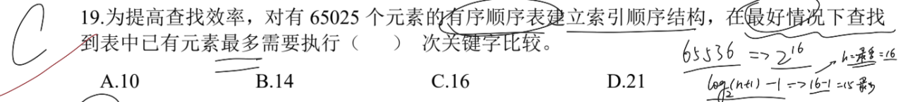
> 此题在当高度为 15 且为满二叉树结构时，总元素个数应该是 $2^{15} - 1 = 32767$；高度为 16 且为满二叉树结构时，总元素个数应该是 $2^{16} - 1 = 65535$
> 则最多的时候，所需要查找的结点位于第 16 层，因此需要比较 16 次。*根结点默认位于第一层。*

> **注意点**：需要构造一个折半查找判定树。当目标关键字所在层数最大时，比较次数最多。
> 
> 满二叉树时总结点数为 15，此时的树高为 4。那么第 16 个元素必定位于第 5 层，因此需要最多比较 5 次。
> 这类题目不存在：**至少需要比较多少次的情况，因为判定树上的每个元素都可以作为目标元素。**

> **注意点**：折半查找的比较序列，必须满足当前比较的关键字被前面的关键字所 **夹住**。即其大小只能被前面的关键字元素所限制，不可超出。
> 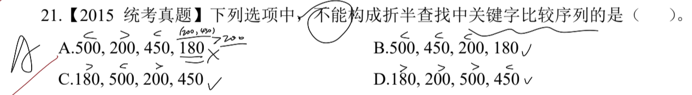
> A 选项：
>  第一个比较 `500`，第二个比较 `200`，说明目标元素是小于 `500` 的；
>  第三个比较 `450`，说明 `200 ＜ tag ＜ 500`；
>  第四个比较 `180`，应该先更新为 `200 ＜ tag ＜ 450`，此时违背了 `tag` 在此前规定的范围：`200 ＜ tag`，因此这里错误。

> **注意点**：一个有序数组的伪代码，可以先带值进去模拟前几次操作。
> 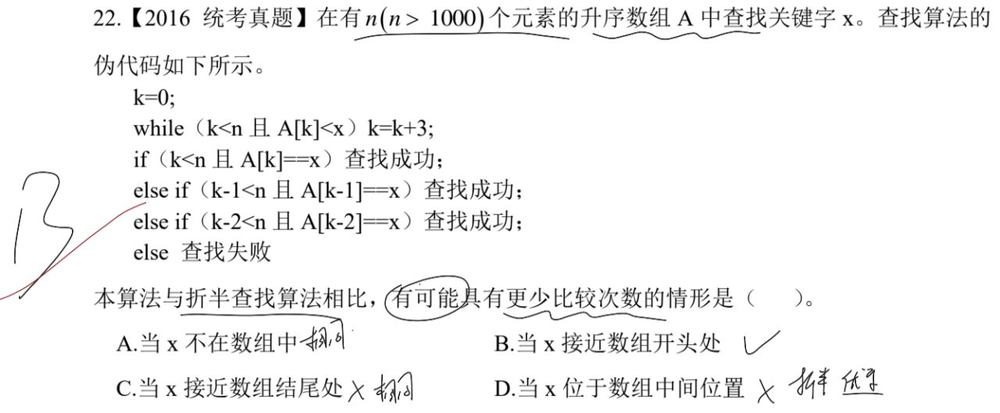
> 这里很明显，每次都在 `0~3` 的范围先查找，如果失败了就再检查 `4~7`。类似于顺序遍历的操作。
> 相对于折半查找每次从中间比起来，只有目标元素在数组开头处时，才有更少的比较次数。
> 对于 A 来说，二者几乎都要遍历整个数组才能确定目标元素不在数组中；
> 对于 C 来说，如果目标元素在最后的位置，折半查找需要 $O(log_2 n)$ 的时间复杂度，而本算法需要 $O(n)$ 的时间复杂度；
> 对于 D 来说，如果目标元素在中间位置，那么折半查找只需要 $O(1)$ 的时间复杂度，而本算法需要遍历前一半的元素。

> **注意点**：折半查找判定树 `Mid` 中的结点的位置应该是始终保持向上或向下取整。
> **需要满足**：
> 左结点数 ≥ 右结点数 + 1；
> 左结点数 + 1 ≤ 右结点数。
> 即：对任意的 [左子树结点值-右子树结点值= `0` 或 `1`]
> 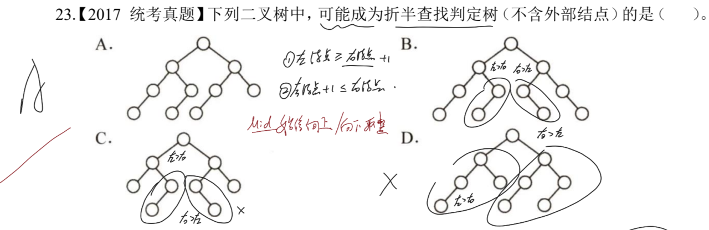 

> **注意点**：构造一个折半查找判定树，可以类比成构造一个完全二叉树。
> 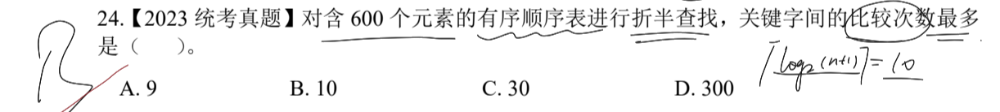
> 高度为 9 的满二叉树，结点总数为 511；高度为 10 的满二叉树，结点总数为 1023。
> 因此 600 介于二者之间，则树高为 10，若需要最多比较次数，目标元素在第 10 层。

---

## 1.4. 分块查找

> **注意点**：分块查找的查找效率最高的分块方式为，$\sqrt{n}$。
> 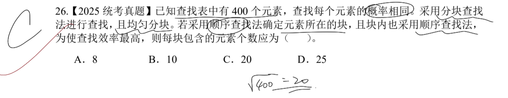
> 因此 $\sqrt{400} = 20$ 个元素。

---

# 二、 树型查找

## 2.1. 基本概念

> 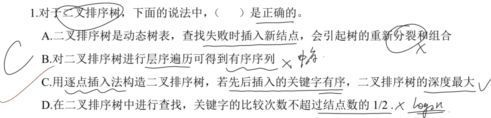
> A：二叉排序树和平衡二叉树不同，每次插入新结点并不会导致树的分裂重组。因此会出现所有结点均在右子树的情况；
> B：二叉排序树的中序序列是一个递增序列；
> C：如果是有序的，那么将会是全在左子树或全在右子树的排布形式；
> D：关键字的比较次数应该是 $log_2 n$，也就是不会超过当前树高。

> **注意点**：二叉排序树的查找效率仅与树高(*树深同理*)相关。
>  

> **注意点**：二叉排序树构造时，不需要考虑当前是否有非平衡的条件。因此极端的构造情况就是结点序列是顺序的，此时全部分布在左子树或右子树上。
>  

---

## 2.2. 二叉排序树(BST)

> **注意点**：当前查找的结点，由前面的结点所夹住。
> .png)
> 这里 C 项：在查找 `240` 之后，下一个查找的结点应该位于 `240 ＜ tag ＜ 911` 之间，而题目给的却是 `912`，超出了范围，因此不符合要求。

> **注意点**：按照二叉排序树的构造方式构造即可，注意 `左 ＜ 根 ＜ 右`。
> 2.png)

> **注意点**：当前查找的结点，由前面的结点所夹住。
> 3.png)
> 这里 A 项：在查找 `24` 之后，下一个查找的结点应该位于 `24 ＜ tag ＜ 91` 之间，而题目给的却是 `94`，超出了范围，因此不符合要求。

> **注意点**：二叉排序树的结点插入和删除不影响平衡，但是可能会根据删除的结点类型不同，导致其重新插入的位置也有所不同。
> 4.png)
> 如果是叶结点，那么重新插入仍然会被插入到原来的位置，因此 T1 和 T3 是一样的。
> 如果删除的是分支结点，那么该分支结点的孩子就会接入到其父结点上，当再次插入时，则必定会挂载到其孩子结点的子树的一部分，而不可能会重新调整回原来的位置。
> 具体分析情况如上图所示的两种调整方式。

> **注意点**：二叉排序树的元素大小遵循中序遍历是递增的序列。
> 5.png)
> 此时中序遍历序列为：`x1 x3 x5 x4 x2`，由左到右递增。

> **注意点**：二叉排序树不需要遵守平衡的限定，只需要满足 `左 ＜ 根 ＜ 右` 的大小关系即可。
> 6.png)

> **注意点**：针对目前已有的结点，利用中序遍历得到递增序列即可清晰大小关系。
> 7.png)
> 中序遍历的序列为：`k1 k3 T k2`，从左到右依次增大。

---

## 2.3. 平衡二叉树(AVL)

> **注意点**：平衡二叉树需要满足任意一个结点的平衡因子只能为 `-1` `0` `1`，平衡因子取决于该结点的左右子树的高度之差(*左高-右高*)
> 若是插入/删除某结点导致不平衡，需要通过旋转使其重新平衡。
> .png)
> A 项：根结点的平衡因子为 `2`，不平衡；
> B 项：各结点平衡因子满足要求；
> C 项：右子树的分支结点平衡因子为 `-2`，不平衡；
> D 项：左子树的高度明显高于右子树，因此不平衡。

> **注意点**：插入或删除结点后，可能导致不平衡。从下往上找到第一个不平衡的结点，由此开始旋转使之重新平衡。
> 2.png)
> `48` 的插入位置在结点 `37` 的右子树上，此时根结点不平衡。
> 将根结点的直接后继(*中序遍历序列上的后一个结点*)作为新的根结点，其余结点按照二叉排序树的性质接入树中。
> 变换情况如上图所示。

> **注意点**：平衡二叉树的结点总数穷举即可。
> 3.png)
> 必须时刻满足平衡二叉树的要求。

> **注意点**：平衡二叉树的构造需要每次插入一个结点就需要判断一次是否平衡，如果不平衡，需要时刻调整使之平衡。
> 4.png)
> 实际最终构造的 AVL 树如上图橙色所示。
> 黑色错误在于插入结点 `6` 时，根的平衡被破坏，没有通过右旋将根结点替换为 `4`，同时原根结点变为左子树，右孩子替换为 `3`，而结点 `4` 的右子树保持不变。
> **很容易出现错误**

> **注意点**：类平衡二叉树的性质考察。
> 5.png)
> A：如果只有两个结点的平衡二叉树，此时根的度应该为 1；
> B：如果左子树只有右孩子，那么此时最小的元素应该是左子树中最下层的分支结点；
> C：最后插入的元素如果打破平衡，则其很有可能被调整变成分支结点；
> D：由于该平衡二叉树的中序遍历序列是降序的，和常规平衡二叉树不同，因此最大元素一定无左子树，可能有右子树(*右子树的元素必定小于分支结点*)。

> **注意点**：和此前的 BST 重插结点不同，平衡二叉树每次删除和插入操作后都必须调整为平衡状态。
> 6.png)
> 如左图 1 所示：如果删除的是右结点，且此时刚好破坏了根结点的平衡，树右旋，再次插入时所构成的树就不一样了；
> 如左图 2 所示：如果时并没有破坏平衡，那么就和二叉排序树相似，重插回了原来的位置。
> --
> 如右图 1 所示：如果删除是分支结点，且未破坏平衡，此时重插的位置和原来不同；
> 如右图 3 所示：如果删除是分支结点，且破坏了平衡，此时重插后可能会导致不平衡，旋转之后仍变为原来的形态。

> 7.png)
> 插入结点后，根结点的平衡被破坏，通过 RL 旋转
> 将其直接后继作为根结点，新插入的结点作为其右子树的分支结点，其余节点按照二叉排序树的性质插入即可。

---

## 2.4. 红黑树

> 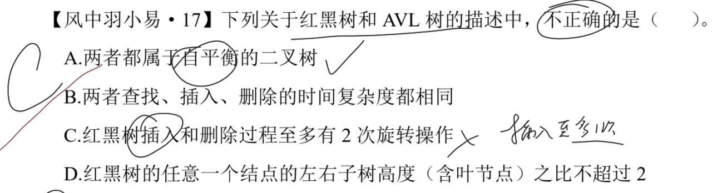
> 红黑树有类似 AVL 树的平衡性质，但 **并不是平衡二叉树**，其本质仍然是二叉排序树；
> 若是 AVL 树，则最可以旋转 2 次，但是红黑树会优先变色，再旋转，那么此时至多需要旋转一次即可。

> 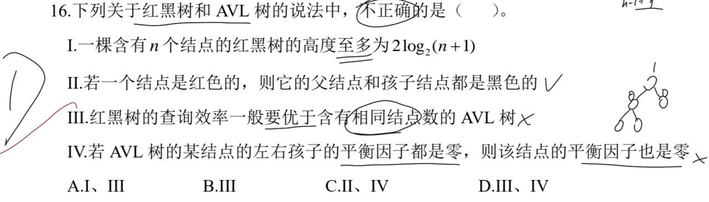
> 在结点数相同的情况下红黑树的查询效率和 AVL 树相同；
> 如果 AVL 树左子树的高度不等于右子树高度，即使左右孩子的平衡因子是 0，其分支结点的平衡因子仍然可能不为 0。

> 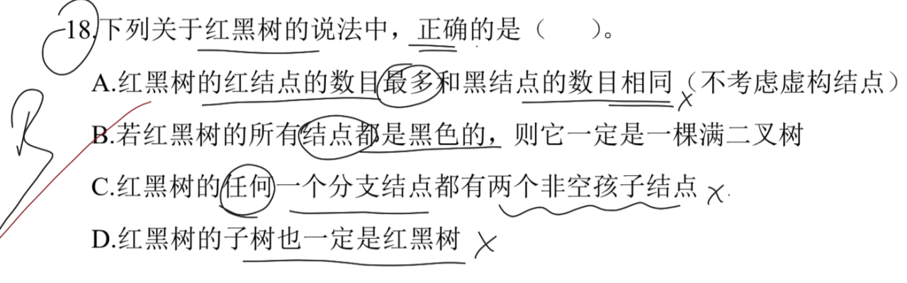
> A：如果是一个只有三个结点的红黑树，此时根结点是黑，左右孩子均为红，红结点数目比黑结点数目多；
> C：外部结点并不算真正的孩子，因此这个说法错误；
> D：不一定的，如果其分支结点当前是红节点，违反了根黑的性质。

> **注意点**：红黑树首先是满足 BST 的所有性质，其次就是红黑树自身所具备的性质要求。
> 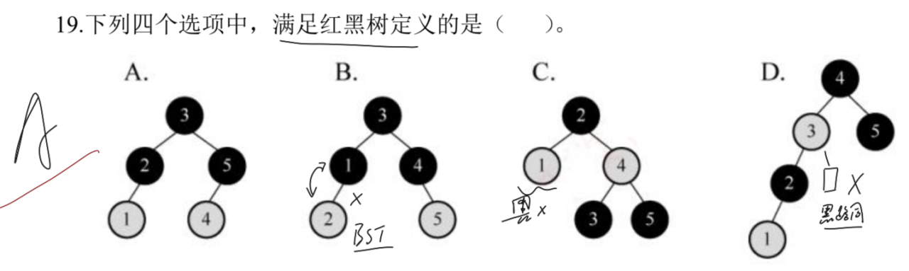
> B：左子树两个结点违反了 BST 的基本性质，`左 ＜ 根 ＜ 右`；
> C：违反黑路同的性质，左子树应该是黑结点，此时从根结点到任意叶结点(*外部结点*)的黑结点数目均为 2；
> D：不仅违反了黑路同的性质，同时还不满足子树的高度差不能超过 2 倍，很明显左子树高 3，右子树高 1。

> **注意点**：默认插入的结点染为红色，根据性质再判断是否需要变色。
> 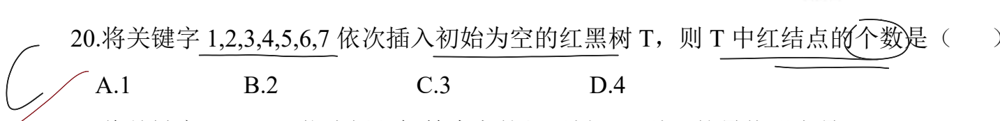
> 构造过程如下图所示：
> 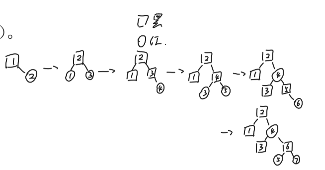

> **注意点**：根据插入结点的的叔结点，判断是先旋转后上色；还是先上色再旋转。
> 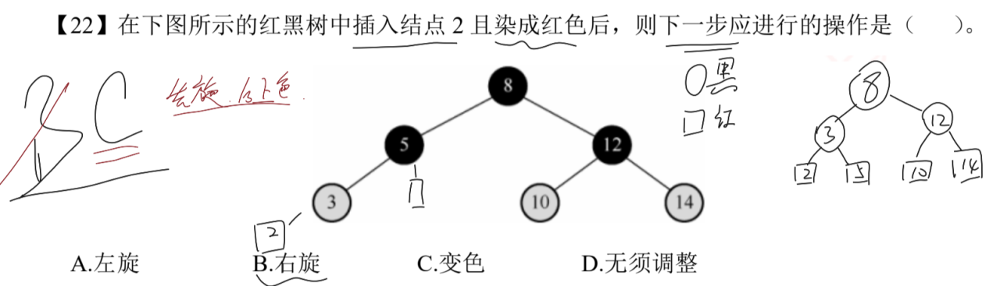
> 此时插入结点的叔是空结点(*外部结点*)，需要先右旋，再将参与旋转的两个结点颜色更替。即 `3` 变为黑；`5` 变为红。

---

## 2.5. B树与B+树

无论是 B 树还是 B+ 树，m 代表阶数时，都需要满足：
**除了根结点外，所有分支结点的子树最少为 $\lceil \frac{m}{2} \rceil$，最多为 $m$；结点内关键字最少为 $\lceil \frac{m}{2} \rceil - 1$，最多为 $m-1$。**
根结点只需要**不超过**最大子树数量和最大关键字数量的限制即可。但一般来说，根结点内关键字至少为 1，子树数量至少为 2。

### 2.5.1. B树和B+树基本概念

> **注意点**：只有在知道具体的阶数时，才可以判断子树数量范围、关键字数量范围。
> 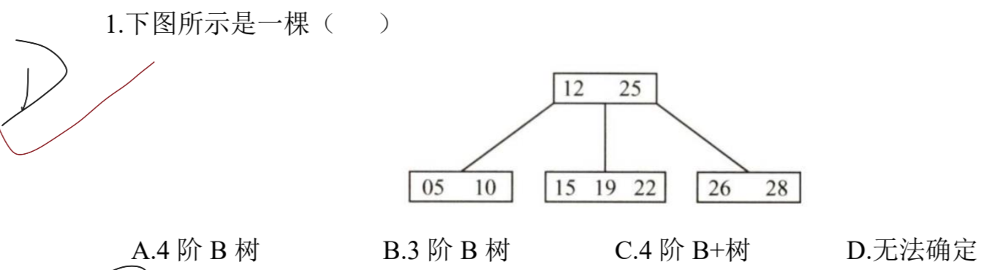
> 此题仅可判断其是一个 B 树(*叶结点没有链式指针*)，且至少是一个 `4阶B树` (*结点中的关键字数量最多的为 3，最少为 2，符合 4 阶 B 树的性质；但不符合 3 阶 B 树对关键字最大的要求 2*)。

> **注意点**：B 树的关键字数量限制。
> 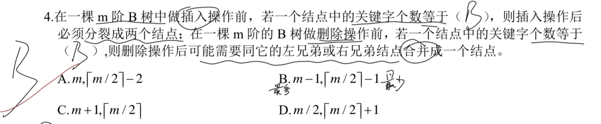
> 如果插入关键字后，结点内出现溢出，则需要取 $\lceil \frac{m}{2} \rceil$ 位置下的关键字，比如如果 m 为 4 时，就取第二个关键字；如果 m 为 5 时，就取第三个关键字。
> 选中的关键字上移入父结点内，如果没有出现溢出，则完成操作，否则反复执行上述操作。
> --
> 如果删除关键字后，破坏了性质，那么就需要从左或右兄弟中，选择一个即使少一个关键字仍然没有破坏性质的兄弟，将一个关键字移动到父结点，将此时父结点对应的关键字移到此前被破坏的结点中。

> **注意点**：根据 B 树的阶数，计算出子树和关键字的范围。
> 最大高度时，需要用最少的子树和最少的关键字构成(*根结点中仅 1 个关键字*)；
> 最小高度时，需要用最多的子树和最多的关键字构成(*根结点中达到关键字的上限*)。
> 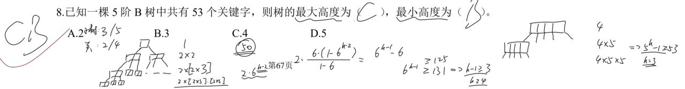
> 如此题中所示：
> 最高的情况下，分支结点拥有 3 棵子树，每个结点中有 2 个关键字(*根结点仅 1 个*)；
> 最低的情况下，分支结点拥有 5 棵子树，每个结点中有 4 个关键字(*根结点中 4 个*)。

> 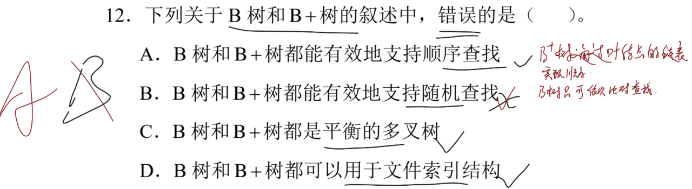
> B 树和 B+ 树均可随机查找，即从根结点开始往下比对查找。
> 但是 B+ 树略有不同，其叶结点存在链表指针，可以从叶结点开始顺序遍历得到结果。
> **B 树的关键字均在各个结点内；B+ 树的关键字仅在叶结点内。**
> **但是 B 树和 B+ 树的叶结点均在同一层。**

> 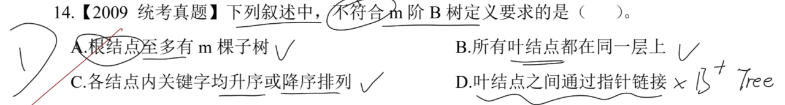
> D：只有 B+ 树的叶结点中存在指针的链接索引。

> 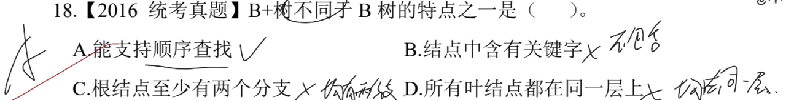
> A：B+ 树因为叶结点通过链表链接，所以支持顺序查找，而又有树的性质，因此还支持随机查找；
> B：B+ 树只有叶结点中含有关键字，其余结点均不含关键字；
> C：无论是 B+ 树还是 B 树，根结点一般都至少有两个分支；
> D：无论是 B+ 树还是 B 树，叶结点均在同一层，**但关键字只有 B+ 树是在同一层。**

> 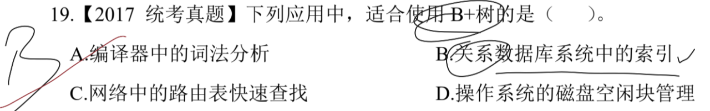
> B+ 树是应文件系统所需而产生的 B 树的变形，适用于 OS 的文件索引和数据库索引，磁盘读写的代价低，且查询效率稳定；
> 编译器中的词法分析使用有穷自动机和语法树；路由表的快速查找通过高速缓存、路由表压缩计数和快速查找算法；OS 的磁盘空闲块使用空闲空间链表管理。

> 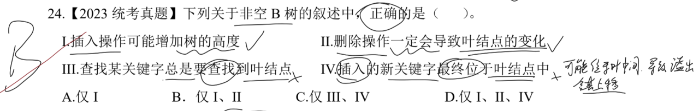
> B 树找某个关键字不一定需要找到叶结点，假设目标关键字正好在根结点，则一次即可找到；而查找到叶结点的应该是 B+ 树，因为所有关键字存储在叶结点中。
> 新插入的关键字如果破坏了 B 树对应阶数下的关键字限定范围，则可能需要调整使其分裂上移。

---

### 2.5.2. B树关键字和结点关系

> **注意点**：根据关键字的限定范围，如果需要关键字至少，则此时构造的应该是最少关键字的情况。
> 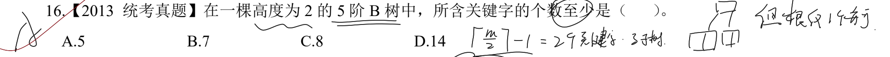
> 因为只需要 h=2，因此无序考虑子树的数量限制，故最少情况下，根结点只有一个关键字，两个子树，左右孩子各有两个关键字，此时最少为 5。

> **注意点**：一个结点中可以拥有多个关键字，根据阶数所限定。
> 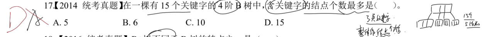
> 如果需要含有关键字的结点数量最多，那么每个结点中应该尽可能包含最少的关键字。根据阶数要求，关键字最少应该为 1 个。
> 因此构造出一个标准的满二叉树结构，树高为 4，此时每个结点中都含有一个关键字，一共有 15 个结点。

> **注意点**：注意事项和上题一致，根据阶数判定关键字数量范围。
> 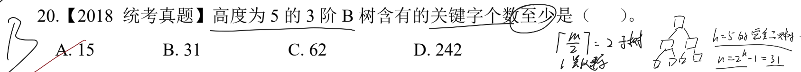
> 每个结点至少包含 1 个关键字，因此构造一个高度为 5 的满二叉树即可。此时关键字总数就是为结点总数 31。

> **注意点**：根据题设要求构造这个 B 树即可，注意关键字和子树的数量范围。
> 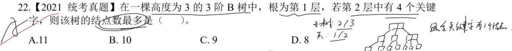
> 具体构造形式如上图所示，每个结点中**可以存在多个关键字**。

> **注意点**：穷举即可，以根结点中有 1 个关键字，2 个关键字，依次往后推。
> 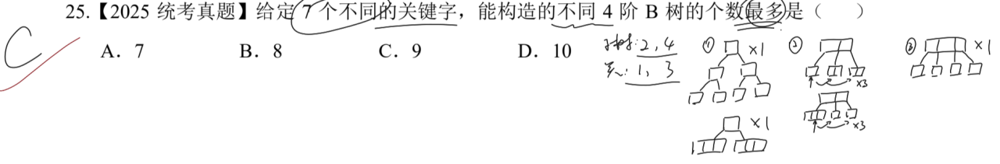
> 因为阶数为 4，所以根结点中关键字最多只能为 3 个。
> 具体构造情况如上图所示，满足关键字和子树的数量限制即可。

---

### 2.5.3. B树插入和删除

> **注意点**：B 树的删除，如果删除后不破坏性质，则直接删除即可。若是破坏了性质，就需要从左或右兄弟中借一个结点来满足性质。
> 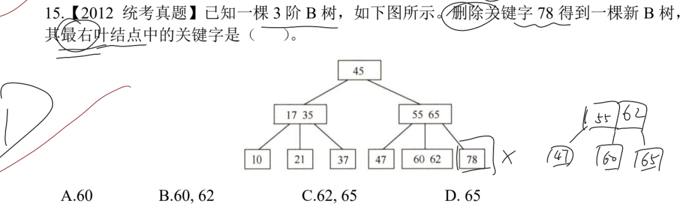
> **借结点**，并不意味着直接拿来就用，而是将借来的结点和父结点中的关键字进行交换，将父结点中的关键字作为**真正借来的结点**。
> 这里就是将左兄弟的 `62` 结点借走，令其上移至父结点，将原父结点中右侧关键字下移至最右孩子结点中。
> 删除后的情况如上图中所示，最右叶结点中关键字为 `65`。

> **注意点**：先规定好子树和关键字的限定范围。构造空 B 树时，需要先尽可能满足最底层的结点，优先使其达到上限。
> 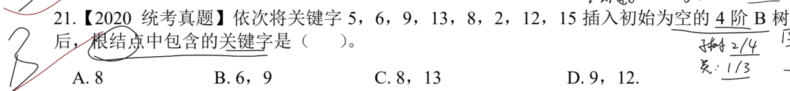
> 如下图所示：
> 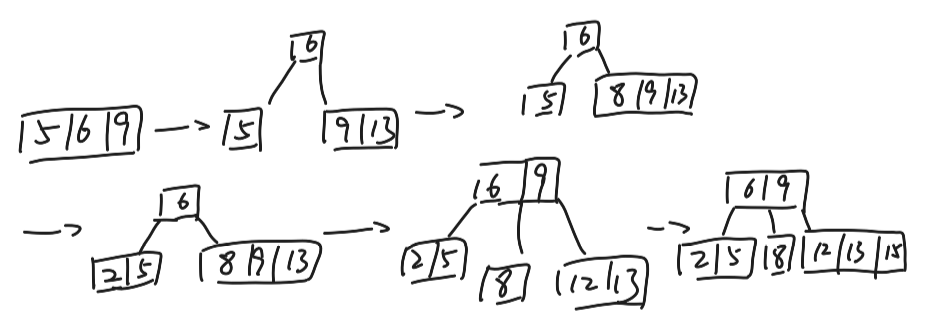
> 前三个关键字均处于根节点中，直到第四个关键字插入，使其分裂，被选中的关键字上移作为根结点中的关键字，其左侧的关键字组合作为左子树，右侧的关键字组合作为右子树。
> 继续按照排序树的性质，按照大小对应，移动到对应的结点中。**需要注意，需要先将关键字插入结点内，且排好序之后才判断是否需要分裂，无论是上溢还是下溢，都需要根据选中的关键字来分裂成两个关键字组合。**
> 最后构造情况如上图中所示，根结点中包含关键字为 `6 9`。

> **注意点**：仍然是先规定好子树和关键字的限定范围。讨论删除时从哪个孩子中 *“借用”* 结点。
> 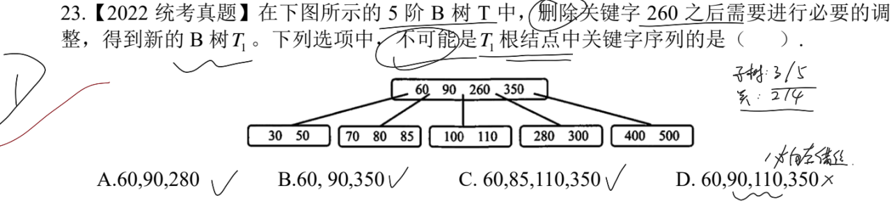
> 如下图所示：
> 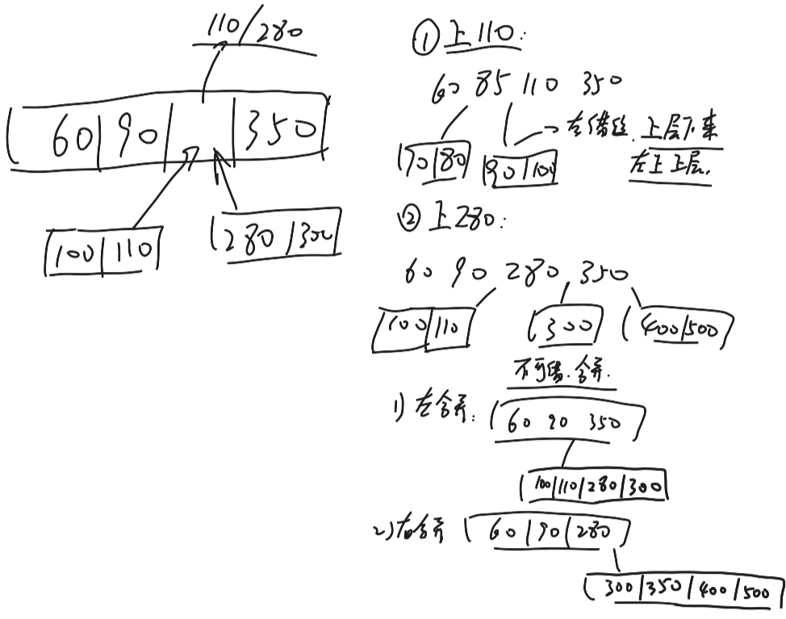
> ①：如果从左孩子借结点：导致左孩子的性质被破坏，考虑从其左右兄弟中 *“借用”* 关键字，如果只有一个兄弟借后不破坏性质，那么就只从这个兄弟借，若两个都可能破坏性质，则需要讨论两种情况。
> 这里只需要从左兄弟借用结点，构造方式如上图①所示；
> ②：如果从右孩子借结点：导致右孩子的性质被破坏，考虑从其左右兄弟中 *“借用”* 关键字，此时左右兄弟无论哪个借用后都破坏了性质，所以就考虑和左右兄弟进行合并，此时讨论：
>  1)：如果和左兄弟合并，构造情况如上所示，将父结点中夹住的关键字下移，组合成新的结点 `100 110 280 300`；
>  2)：如果和右兄弟合并，构造情况如上所示，将父结点中夹住的关键字下移，组合成新的结点 `300 350 400 500`。
> --
> 只有 D 项：根结点中不可能出现 `90` 和 `110` 同时出现的情况，这时候必须要从左兄弟借结点，从而根结点中的关键字下移，左兄弟的结点上移作为父结点中的关键字。

---

# 三、 散列表

## 3.1. 基本概念

> **注意点**：考察存储结构适用的查找方法。
> 
> 只有折半查找法只适合顺序存储结构，并且数据必须是有序序列。
> 对于顺序查找法，比如：顺序表和链表；
> 对于树型查找法，比如：B 树和 B+ 树；
> 对于散列查找法，比如：开放地址法和链地址法构造的散列表。

> **注意点**：散列查找的适用范围。
> 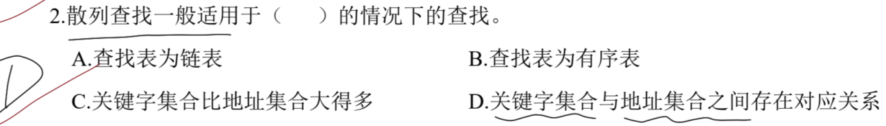
> 散列表的查找表可以是顺序表(有序表)，也可以是链表，分别对应两种散列表的构造方式；
> 关键字集合和地址集合存在对应关系，即 **散列函数** 的映射关系 $Hash(key) = key$。

> **注意点**：互为同义次，经过散列函数定址后会指向同一个位置，因此需要处理冲突的方法。
> 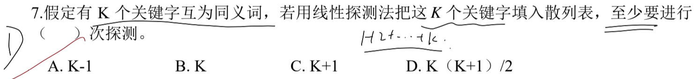
> 线性探测法就是从冲突位置开始，依次往后查找空闲位置用以存放当前关键字，如果超过了表长，就从头开始继续寻找。
> 这里 K 个关键字都是同义词，那么经过散列函数处理后必定是在同一个位置，因此线性探测法依次探测 $1, 2, \cdots, k$ 次。
> 综合来看就是 $K(K+1)/2$。

> **注意点**：散列表的查找效率关系。
> 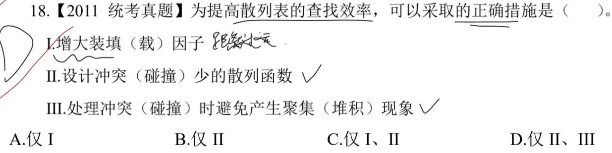
> 装填因子指的是装满程度，即 记录数/表长，装填因子的大小和查找效率没明显关系，大说明内元素多表短；少说明内元素少表长。
> 优秀的散列函数，使得关键字能较好地填入散列表中，每个空位都得到充分利用，查找效率增高。
> 处理冲突避免聚集现象，探测的次数就会减少，每次探测以较少的次数达成目标。

> **注意点**：出现堆积，会导致查找元素的查找次数增多。
> 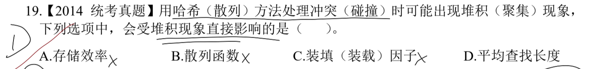
> 只有平均查找长度会因为堆积而出现各个元素的比较次数增加，平均比较长度增加。

> **注意点**：散列表的平均查找长度影响因素。
> 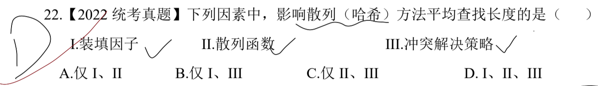
> 装填因子过大：表越满，冲突概率越高，ASL 增高；
> 好的散列函数使得关键字均匀分布，冲突少；差的函数使得关键字容易聚集，冲突高；
> 冲突处理的链地址法不容易聚集，但线性探测可能会导致聚集，从而使得 ASL 增高。

> **注意点**：线性探测和二次探测相关概念。
> 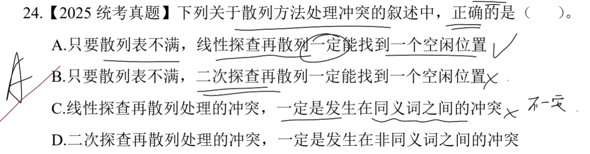
> 线性探测是按顺序依次往后寻找空闲位置，若表不满必定会找到空位；二次探测是按平方步长跳跃查找，若表空闲的位置不在跳跃的位置，这时候就找不到空位。
> 线性探测处理冲突只有第一次处理时必定是同义词，此后可能是同义词也可能是非同义词。
> 二次探测处理冲突同理。

---

## 3.2. 散列函数与处理冲突

### 3.2.1. 记录数量和对应位置

> **注意点**：链地址法构造的散列表，每个经过散列函数映射下的位置组成一个链表，可以采用头插法插入对应关键字。
> 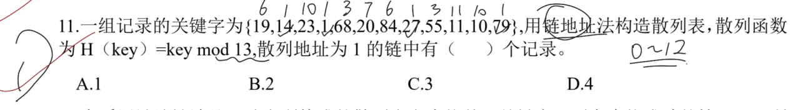
> 经过模运算，结果为 `1` 的关键字有 `14 1 27 79` 四个关键字，因此记录为四条。

> **注意点**：根据散列函数可以得到散列表的地址范围，对关键字继续取散列函数模运算，若发生冲突，就依次往后遍历直到空位。
> 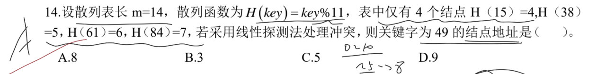
> `49` 对 `11` 取模，结果为 `5`，但表 `5` 的位置已有关键字，则处理冲突依次往后遍历，直到空闲位置在 `8`，同时还满足在散列表的范围 `0~10`。

---

### 3.2.2. 平均查找长度

$ASL_{成功} = 比较次数之和 / 关键字个数$
$ASL_{失败} = 所有位置的最少查找次数 / 模数$
> **tips**：这里最多查找次数指的是从当前结点到空位置(*含本身*)，需要查找几次。如果本身就是空，则默认 1，可以循环。

> **注意点**：调用散列函数计算对应关键字待放位置，如果冲突，就根据冲突处理方案调整。线性探测再散列指的是插入和查找关键字冲突都是线性探测法。
> 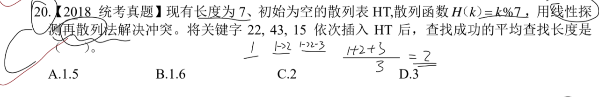
> 这里发现三个关键字都是映射到 1 的位置，因此线性探测处理后，分别对应到 `1 2 3` 的位置上。
> 那么 $ASL_{成功} = \frac{1 + 2 + 3}{3} = 2$.
> --
> 换一个问题：如何求 ASL 失败？
> 位置 | 0 | 1 | 2 | 3 | 4 | 5 | 6 |
> 失败 | 1 | 4 | 3 | 2 | 1 | 1 | 1 |
> 此时 $ASL_{失败} = \frac{1 + 4 + 3 + 2 + 1 + 1 + 1}{7} = \frac{13}{7}$ 

> **注意点**：按照散列函数插入关键字，出现冲突就往后找空填入。
> 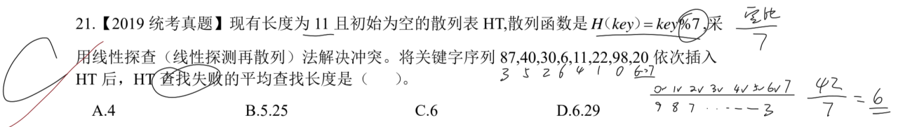
> 欲计算 ASL 失败，需要列出最少查找次数表格：
> 位置 | 0 | 1 | 2 | 3 | 4 | 5 | 6 |
> 失败 | 9 | 8 | 7 | 6 | 5 | 4 | 3 |
> 此时 $ASL_{失败} = \frac{9 + 8 + 7 + 6 + 5 + 4 + 3}{7} = \frac{42}{7} = 6$ 

> **注意点**：失败平均查找长度的分母代表的是映射范围，也即是模指针范围。**删除关键字不代表此处的指针域也被删除，将用 DEL 代替标记，否则线性探测会被中断。**
> 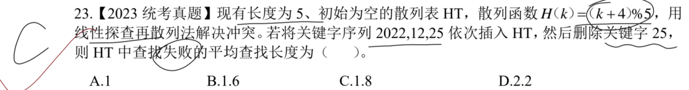
> 如下图所示：
> 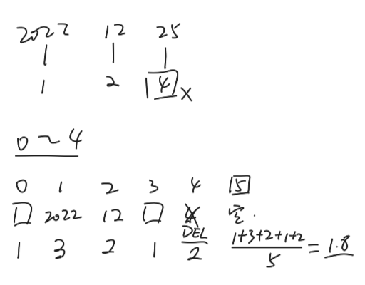
> 先插入关键字序列，再删除关键字。删除关键字的位置用 `DEL` 代替，标识此处非空。
> 后续操作如上图所示。
> 需要注意，删除后的位置仍然算作一个关键字，但是没有任何实际意义。
