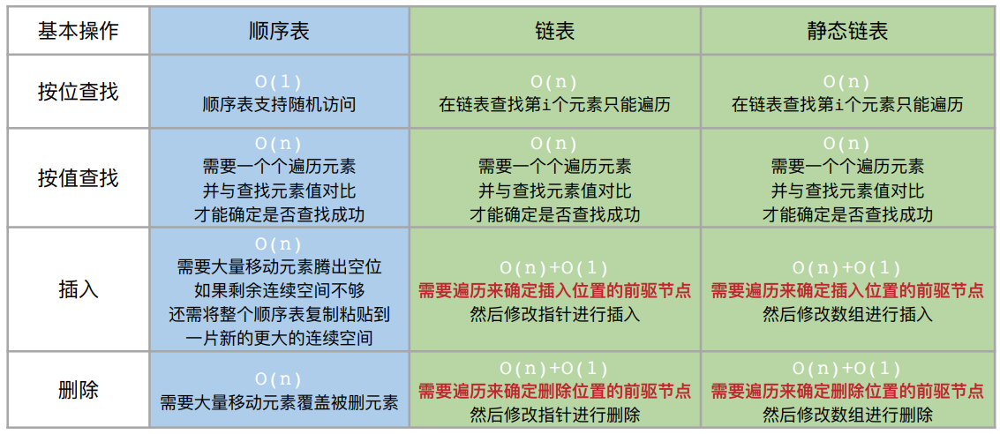
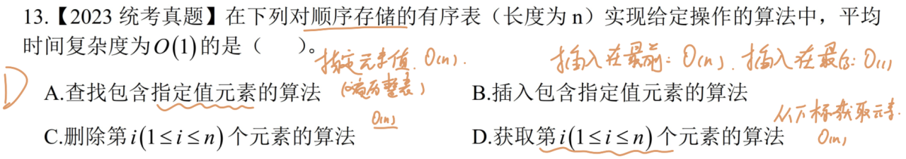
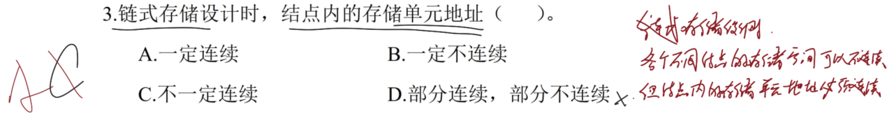
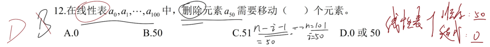
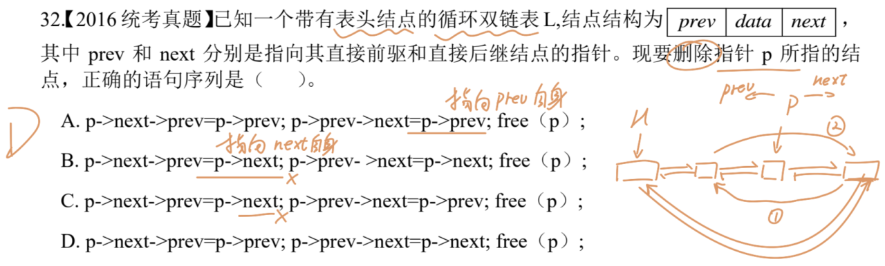

# 一、 顺序表、链表、静态链表操作的时间复杂度

---

## 顺序表的基本操作

> **关键点**：区分顺序表查找指定元素和获取指定下标元素的时间复杂度不同。
> 
> 前者需要遍历**整个顺序表**，后者只需要根据**对应下标**获取元素即可。

---

## 链表的基本操作

> **关键点**：需要注意结点内和结点外的区别。
> 
> 链式存储的各个结点之间在物理地址上不必连续，但每个结点的内部是一整块连续的空间。

> **注意点**：线性表包含顺序存储和链式存储两种类型。
> 
> 顺序存储时，删除元素需要将其后的所有元素依次向前移动覆盖；链式存储时，删除元素只需要将该结点的前驱结点的 `next` 指针指向该结点的 `next` 结点。

> **注意点**：每次的操作均不可破坏指向的连续性。
> 
> `p->next->prev=p->next` 操作是令 `p` 结点 `next` 结点的前驱结点指向 `p` 结点的 `next` 结点本身；
> `p->prev->next=p->prev` 操作是令 `p` 结点 `prev` 结点的后继结点指向 `p` 结点的 `prev` 结点本身；
