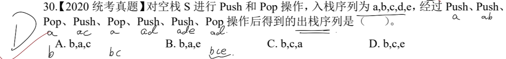
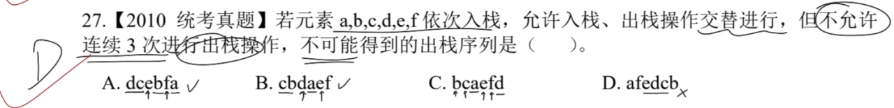
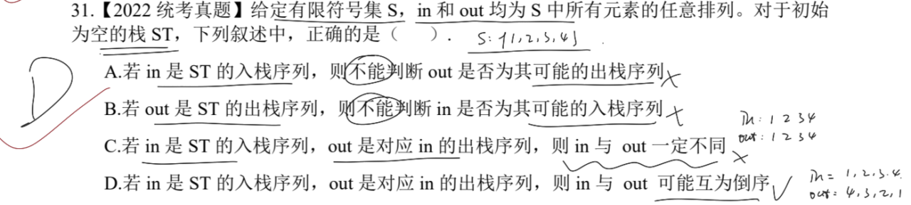
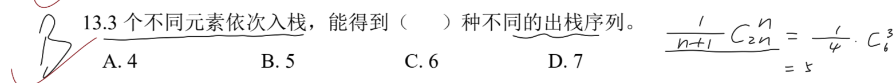
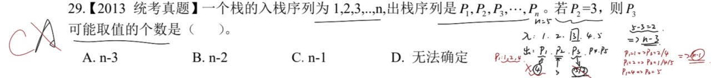
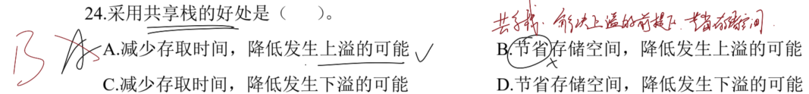

# 一、 栈出入顺序

## 1.1. 给定入栈序列求出栈序列

> **注意点**：注意看清楚题目所求是什么内容，再根据 `Push` 和 `Pop` 操作得到结果。
> 
> `Push` 作为入栈操作；`Pop` 作为出栈操作。

---

## 1.2. 限制出入栈的操作

> **注意点**：根据限制要求，直接找到对应违背限制的序列即可。
> 
> D 选项中，有连续的出栈序列 `edcb`，不满足题意。

> **注意点**：未知具体的栈情况，可以假定一些随机序列。
> 
> 根据题目要求，判断可能的情况，一般 **一定不同** 的字眼有很大问题。
> 知道入栈/出栈序列，一定可以判断另一个序列是否为对应的出栈/入栈序列。

---

## 1.3. 卡特兰数的应用

> **注意点**：可以通过自定 {a, b, c} 序列求解；也可以根据卡特兰数的计算公式 $\frac{1}{n+1} C^{n}_{2n}$。
> 
> 详细结算过程：$\frac{1}{n+1} C^{n}_{2n} = \frac{1}{4} \cdot \frac{6!}{3! \cdot (6-3)!} = 5$

---

# 二、 根据部分已知序列_推算元素取值

> **注意点**：考虑所有取值的组合，最后根据组合得到取值个数。
> 
> 由栈的特性，后进先出。依次推断。

---

# 三、 共享栈

> **注意点**：注意共享栈的概念。
> 
> **共享栈**：在解决上溢的前提下，节省存储空间。
