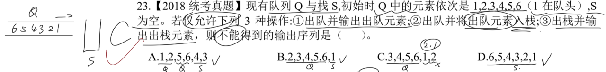
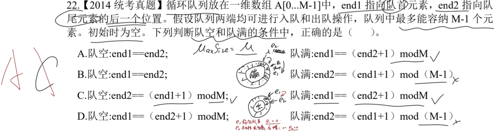

# 一、 队列的出入顺序

## 1.1. 一般的队列(单端队列)

> **注意点**：根据题意模拟操作即可，没有限定是否必须先入后出，故可以交替执行。
> .png)
> 画出两个队列，找出可能的序列，排除法做题。
> 一般来说，递增或递减的序列都是可行的。

---

## 1.2. 复杂的队列(双端队列)

> **注意点**：注意可操作的端有哪些，依次模拟即可。
> .png)
> 模拟即可，满足队列的基本原理。

> **注意点**：注意可操作的端要求。
> 2.png)
> 可以将出队序列逆序，看此时是否满足入队序列。(*针对一端受限，往反方向考虑*)

---

## 1.3. 队列和栈的组合

> **注意点**：注意栈和队列的特点即可。
> 
> **队列**：先进先出；**栈**：先进先出。根据要求模拟操作即可。
> 一般来说有序序列都是可行的(*逆序/顺序*)。

---

# 二、 循环队列

## 2.1. 计算循环队列的 front 和 rear

> **注意点**：注意入队和出队指针的变化情况。
> 
> 题目要求第一个入队元素必须存储在 `A[0]` 位置，那么 `rear` 在每次入队操作时需要对 `MaxSize` 进行加 `1` 取余操作后，再插入值，因此其初始指向 ` n-1 `。` front ` 由于不需要对 `MaxSize` 取余，故初始为 `0`。

---

## 2.2. 判断队空队满的情况

> **注意点**：具体问题具体分析，循环队列队满时，需要 `%MaxSize` 操作。队空可以思考一下如果入队一个元素，具体操作和指针变化如何。
> 
> 这里的 `MaxSize` 很明显，为 `M`，所以 B、D 两项错误。
> 关键点在于怎么判断队空，由于 `e2` 指向队尾元素，`e1` 指向队首，当队空时，`e1` 必定指向 `0` 位置，`e2` 作为入队位置，**这里的入队的操作是先放值，指针再加 1**，和上一个题型不同，所以这里 `e2` 初值也为 `0`。
