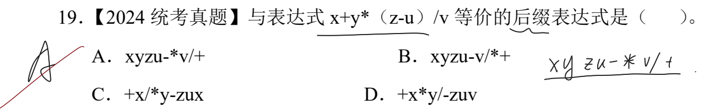
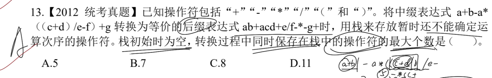
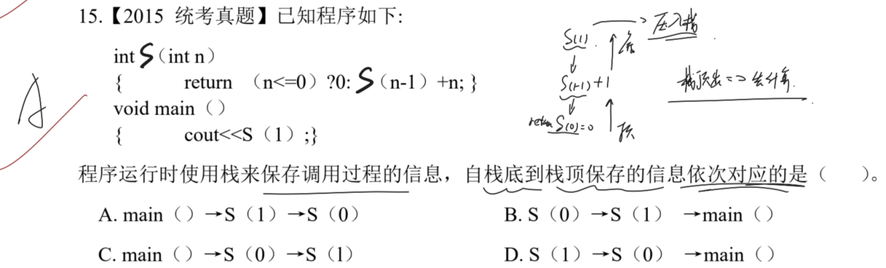
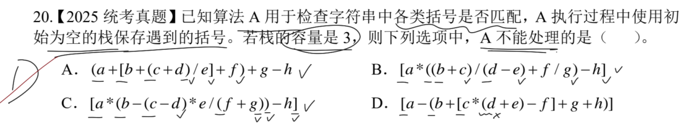
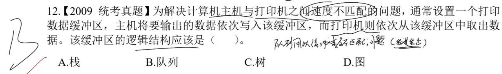
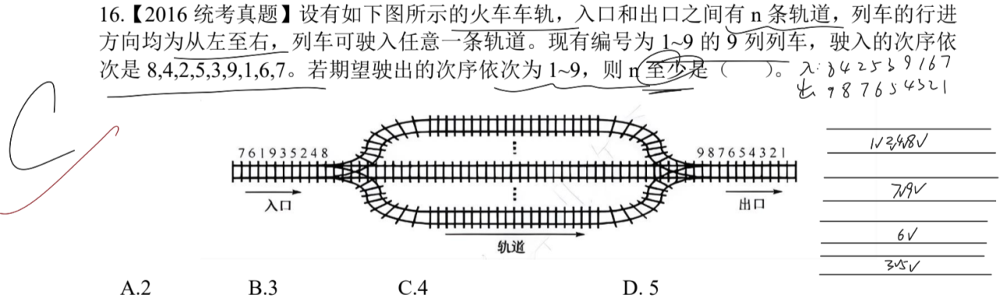

# 一、 栈相关的应用

## 1.1. 表达式之间的转换

> **注意点**：注意需要转化成什么表达式。按照规则转化即可。后缀表达式就按照优先写操作数，再写操作符。
> 
> 这里注意有 `()` 的存在，因此需要先计算 `zu-`，所以置于最内层。遵循括号、乘除、加减的顺序，且从左往右的次序。

> **注意点**：需要注意栈运算的弹出逻辑。碰到成对的 `()` 时，需要将 `(` 之后的内容全部弹出计算，结果再压入栈。
> 
> 这里最长的操作符次序是 `-*((+` 而此时已经执行到 `c+d`，下一个操作符是 `)` 就需要将前面的 `(` 和 `cd+` 组合压出计算。

---

## 1.2. 栈实现的递归调用

> **注意点**：最后是需要输出一个结果，所以最后返回结果必定是 **从栈中压出**。
> 
> 这里写出递归的顺序，自上而下。而真实需要的结果是 `S(1)` 对应的值，由 `main()` 最后返回。
> 想要得到 `S(1)` 的值，就需要先计算 `S(0)` 的值，因此 `S(0)` 位于栈顶(*优先压出计算，结果再压入栈参与 `S(1)` 运算*)，`main()` 位于栈底。

---

## 1.3. 栈的括号匹配的问题

> **注意点**：注意一旦括号成对匹配了，那么就必须弹出，而 `)` 无须进行入栈的操作。还需要考虑是否是同一类型的括号：如 `()`、`[]`、`{}`。
> 
> 这里的 A、B、C 三项都是能够成功匹配，**栈满不影响 `)` 的匹配操作**。
> D 项连续入栈 4 个 `(` 导致栈溢出，因此无法处理。

---

# 二、 队列相关的应用

## 2.1. 队列的应用场景

> **注意点**：注意队列的基本原理：“先进先出”，依次排队。
> 
> 打印机和主机之间速度不匹配(*主机速度>>打印机*)，所以需要一个缓冲区，而实现的是依靠队列(*还需要保持任务的次序*)。

> **注意点**：依次比对入队和出队序列。后入队的元素若想先出队，那么必定得在一个新的队列中的队首位置。
> 
> 这里典型的就是 `9`，由于入队位置偏后，而又是最早出队的，因此 `9` 必定占据一个队列。
