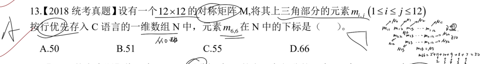
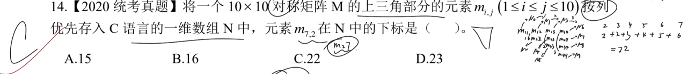
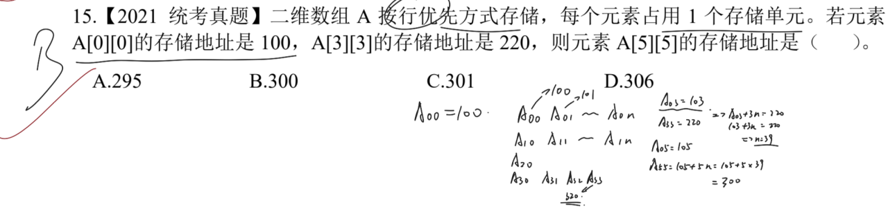

# 一、 推算某元素的下标

**行优先**：先存储当前矩阵的一整行；
**列优先**：先存储当前矩阵的一整列。

---

> **注意点**：注意矩阵的大小、按什么方式存储那些部分的元素。
> 
> 这里因为上三角，所以先模拟写出前 `3-4` 行的存储情况，对应数组 `N` 的位置。然后找出规律，计算下标即可。

> **注意点**：画出上三角的模型后，根据要求按列存储即可。即数组 `N` 先存储第一列，再第二列……
> 
> 按照要求处理即可。注意因为不是完整的矩阵，所以 行与行/列与列之间并不是固定的数值关系。

---

# 二、 知道部分元素存储地址推算元素的存储地址

> **注意点**：根据已知信息推算出一行/一列有多少个元素。
> 
> 关键点在于算出一行有多少个元素。因为已知 `A[0][0]` 和 `A[3][3]`，设一个 `n` 作为行元素个数。
> 推算出二者之间相距多少个元素，等式关系推算即可。同样的方式还可再推出问题所求。
