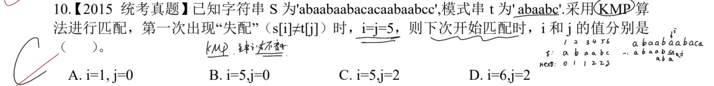
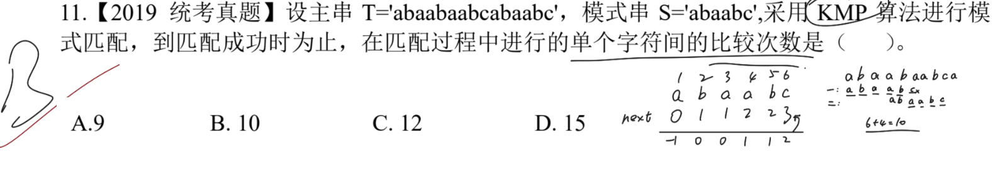

# 一、 KMP

**next 求法**：做一个中间变量记作 `t`。`t` 的值取决于不包含当前位置元素的前面最长前后缀。
- 若当前是第一个元素，那么 `t` 值为 `-1`；
- 若当前是第二个元素，或者说前面至少有一个元素，且没有前后缀，那么 `t` 值为 `0`。
- 而 `next` 为 `t` 值每个位置 `+1` 处理。
**nextval 求法**：第一位默认为 `0`。后续根据 `next` 跳转的位置元素对比。
- **跳转序号**：以第一个元素作为序号 `1`，往后依次 `+1`。假设 'abcd'，那么序号依次是 `1 2 3 4`。
- 若是相同，就取跳转位置的 `nextval` 值作为当前位置的 `nextval`；
- 若是不同，就取当前位置的 `next` 值作为当前位置的 `nextval`。
**滑动距离**：用 `当前位置的跳转序号-nextval`。

## 1.1. 失配时指针指向

> **注意点**：主串的指针始终不会减少(*KMP 的特点*)。列出 KMP 的 next 即可。
> 
> 这里根据 KMP 特点其实能绝对排除选择 A，不过还不够。
> 列出 next 数组，然后找到指针指向 5 时(*指针默认从 0 开始*)，匹配是否成功。
> 不成功就根据指向位置的 next ，模式串指针跳转到对应的位置 `3-a`。而主串的指针保持不变，所以这里 `i=5`，`j=2`。
> 若是跳转到了 `1-a` 仍然没有匹配上，那么主串指针 `+1`，模式串指针为 `0`。

---

## 1.2. 匹配过程中的比较次数

> **注意点**：模式串直到第一个位置匹配也失败时，就需要移动主串指针指向下一个位置开始匹配。否则只移动模式串的指针。
> 
> 第一趟匹配 `a b a a b c`，`c` 出现匹配失败；
> 移动到 `c` 对应的 `next=3` 进行匹配。
> 第二趟匹配 `a a b c` 结束。
> 共计 `6+4=10`。

---

# 二、 改进的 KMP

> **注意点**：修正后的 `next` 代指 `nextval` 数组，即采用改进的 KMP 完成。
> 
> 这里依次求出 `next` 和 `nextval` 数组。
> `next`：`0 1 2 1 2 3`；
> `nextval`：`0 0 2 0 0 2`。
> 滑动距离取决于当前位置以及当前位置对应的 nextval 数组。由当前位置序号减去 nextval 值。
> 每个位置下移动距离为：`1 2 1 4 5 4`。
