# 一、 树和二叉树基本概念

## 1.1. 树的结点数和度数

> **注意点**：总结点数与度数之间的关系，总结点数与各个不同度结点的关系。
> 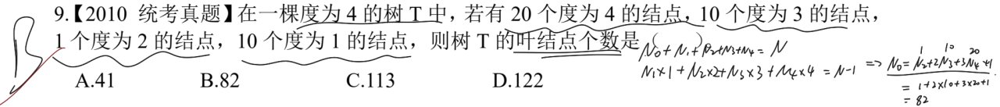
> 列出两个等式：
> 结点总数与各个度类别的关系：$N_0 + N_1 + \cdots + N_n = N$；
> 结点总数与度总数的关系：$N_1 \cdot N_1 + N_2 \cdot N_2 + \cdots + N_n \cdot N_n = N - 1$。
> 得到叶结点 $N_0=82$。

> **注意点**：森林由多个树组成，互相独立。考察推算/树的基本概念。
> 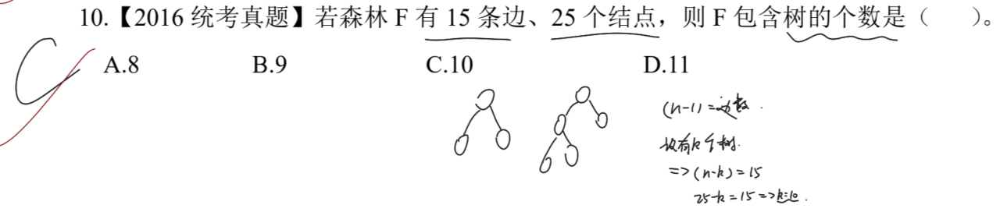
> 除了如图中所示的简单举例求值，还可以根据树的基本概念：
>   边数=度数。因此有：N-1=度数=边数。因为是森林，森林由多个树构成。因此 N-边数=树数 => 10 个。

---

## 1.1. 二叉树叶结点相关

> **注意点**：完全二叉树的概念。需要看清题目要求是至多还是至少。
> 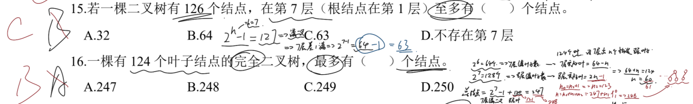
> 第一题：
>   首先需要得到该二叉树的至少多高，根据 $2^h-1=127≥126$ 可以推算出，h=7，最后一层差一个结点称为满二叉树
>   因此第 `7` 层结点数应该是 $2^{7-1} - 1 = 64 - 1 = 63$。
> 第二题：
>   如果不是满二叉树，那么其叶结点由最后一层和倒数第二层构成。
>   这里很明显不是满二叉树，第 `7` 层至多 `64` 个结点，第 `8` 层至多 `128` 个结点，`124` 介于二者之间，说明该树高为 `8`。
>   第 `8` 层能从第 `7` 层提供的结点中获取 `1/2` 个叶结点，由于需要最多的结点数，那么最后一个结点只提供 `1` 个结点给第 `8` 层。
>   因此可得：
>   $64+n-1=124; \ n=61$；
>   $N_0 = N_2 + 1; \ N_2 = 123$；
>   $N = N_0 + N_1 + N_2 = 247 + N_1; \ N = 248$。

> **注意点**：完全二叉树的性质考察。只需要得到树高即可进一步得到最后一层结点数，以及从倒数第二层中取走了多少结点作为延申。
> 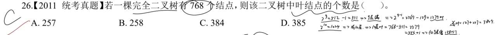
> 这里根据总结点数为 `768`，可得树高 `10`。那么第 `9` 层是满的。得到第 `10` 层有 $768 - 511 = 257$ 个结点，而第 `10` 层是通过第 `9` 层的叶结点中分得的。
> 因此第 `10` 层向 `9` 层借了 `128+1` 个结点。
> **总叶结点数 = 127 + 257 = 384 个**

---

## 1.3. 二叉树的存储方式

> **注意点**：顺序存储结构，需要在存储数据之前就申请一篇连续的存储空间。为了存储单元尽可能满足所有形态的二叉树，因此需要尽可能为满二叉树的结构的存储空间。
> 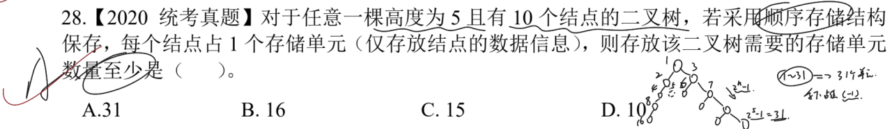
> 构造一个满足题意的二叉树，由于二叉树的编号是从根节点开始，`1~31` 一共 31 个存储单元。
> 而没有数据的空结点内容均填入 `-1`，因此至少需要 `31` 个存储单元。
> **如果更换题意**：改成链式存储结构的二叉树，那么存储单元仅需 10 个即可，因为链式存储无须提前申请一片连续的地址空间。

> **注意点**：顺序存储结构。根据题意按顺序构造二叉树即可。每个结点都必须有值(*为空时存放 `-1`*)。
> 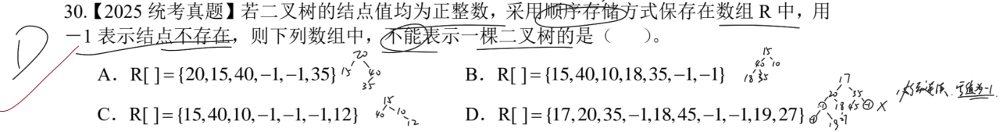
> D 选项前三层正常，但是第四层在 **空结点** 上有右孩子，而这不满足二叉树的性质。除了根结点外，每个结点都必定有其父结点。空值并不算一个完整的结点，`-1` 仅是起到占位的作用，表明这里可以存放二叉树的数据。

---

# 二、 二叉树的遍历

## 2.1. 已知前后推算可能的二叉树结构

> **注意点**：一个二叉树若是想要被确定，必须有中序遍历序列。当没有时，二叉树的形式是不定的。
> 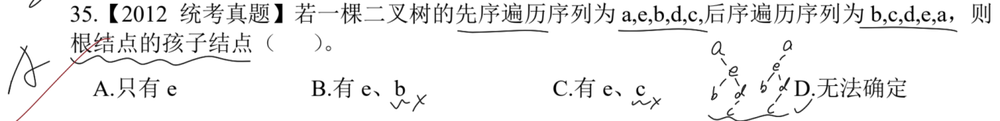
> 这里根据先序序列和后序序列，得知 a 必定是根结点。依次推即可。
> 可以有两种形态 e 位于根结点 a 的左子树或右子树中。如上图中所示。

> **注意点**：仅凭前后遍历序列无法确定一个二叉树，因此可以转化思路：将选项作为已知条件之一，依次和先序(后序)序列构成一个二叉树，然后再后序(先序)遍历这个二叉树，看是否符合题目中的遍历序列。
> 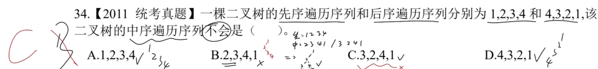
> 这里 C 选项，如果选择先序序列和该中序序列构造二叉树，结构如下：
>    1
>    /
>   2
>  / \
> 3   4  那么此时的后序序列是 `3 4 2 1` 和题目所给的不同。

---

## 2.2. 已知一个序列和树形求另一个序列

> **注意点**：根据后序遍历的要求，依次填入结点对应序号即可，然后再根据该二叉树求其前序遍历序列。
> 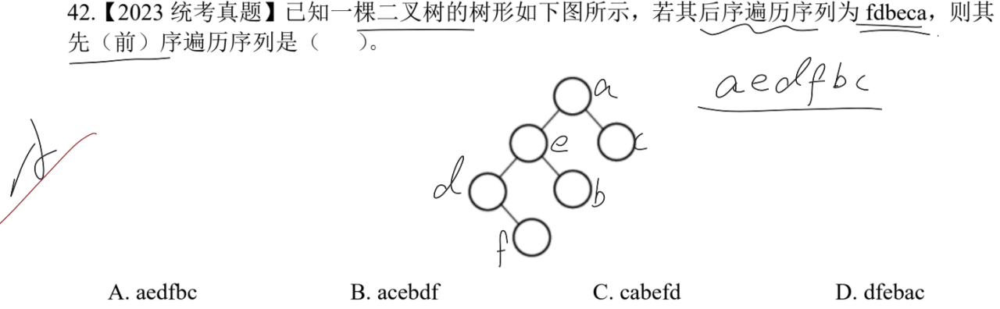

---

# 三、 线索二叉树

> **注意点**：线索二叉树分为前中后三种，和普通的二叉树遍历序列类似。得到遍历序列后，以该结点左侧为前驱，右侧为后继，延伸出线索指针。
> 如果如果而孩子的优先级高于线索指针，当存在孩子的时候，优先指向孩子而不是前驱/后继结点。
> 如果为空，那么就指向 `NULL`。
> 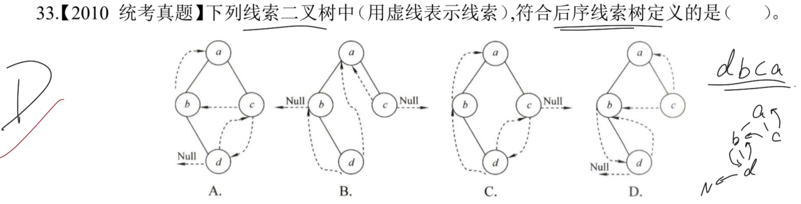
> 结点 `b` 拥有右孩子，所以其右线索指针不存在，而且左线索指针指向其前驱，也就是结点 `d`；
> 结点 `d` 在后序序列中没有前驱，那么其左线索指针就指向 `NULL`；
> 结点 `c` 有前驱结点 `b` 也有后继结点 `a`，因此线索指针依次指向结点 `b` 和结点 `a`。

> **注意点**：只需关注目标结点是否有左右孩子，如果没有，就根据其遍历序列的前驱和后继来找指向结点。
> 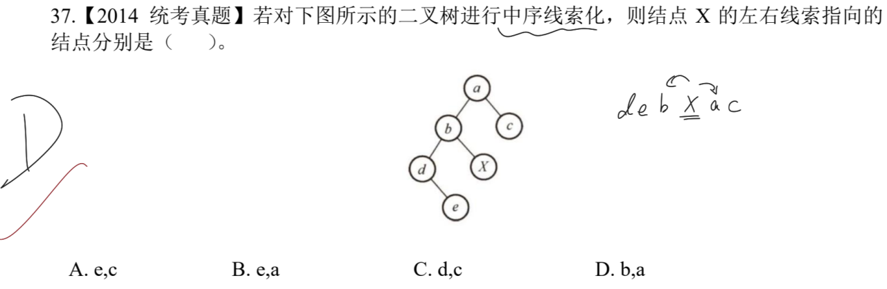
> 将该二叉树的中序遍历写出 `d e b X a c`，其中结点 `b` 是 X 的前驱，结点 `a` 是 X 的后继。

---

# 四、 森林与二叉树

## 4.1. 转换的结点关系

> **注意点**：二叉树转化成森林，需要将右子树的所有右孩子依次分离出去，作为单独的树存在。
> 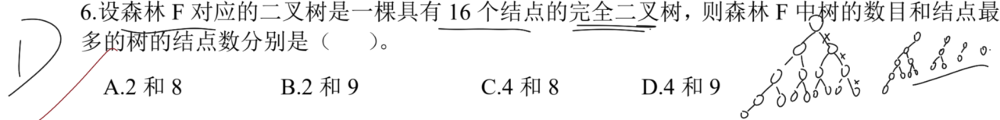
> 画出 16 个结点的完全二叉树，根据二叉树转森林的规则转化。因为该二叉树可以分 3 个右子树，所以就分成 4 棵树(*注意包括带有原根结点的树*)。
> 结点数最多的树是带有原根结点的树。

> **注意点**：森林转化为二叉树时，叶结点必定无孩子结点(*左节点*)。
> 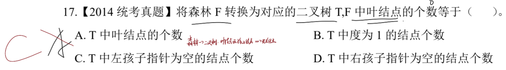
> 森林中的右子树都作为单独的树存在，那么转化成二叉树后，没有左孩子的结点就作为叶结点。

> **注意点**：根据先序和中序遍历构造出二叉树，再转化为森林即可。
> 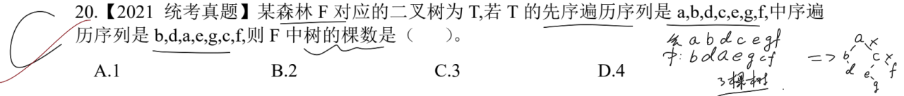
> 二叉树从根结点开始，每个右子树都被单独划分出去作为一棵树。因此总数为 3。

---

## 4.2. 转换的序列关系

> **注意点**：先后跟和二叉树的先中序对应。
> 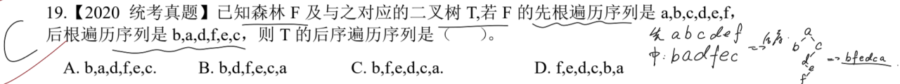
> 此题转化成了已知先序遍历和中序遍历，求后序遍历序列。
> 先通过先序和中序序列构造出二叉树，再基于二叉树应用后序遍历，得到后序遍历序列。

---

# 五、 树与二叉树的应用

## 5.1. 哈夫曼树

> **注意点**：构造一颗哈夫曼树，并计算其 WPL 即可。
> 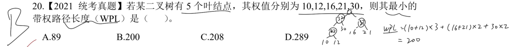
> $WPL = \sum_{i=1}^{i=n} 叶子结点i的值 \times 从根结点到其的路径数量$。
> 根据上述公式计算：$WPL = (10 + 12) \times 3 + (16 + 21) \times 2 + 30 \times 2 = 200$
> 也等于各个分支结点的总和(*包含最后的哈夫曼树的根结点*)：$WPL = 22 + 52 + 37 + 89 = 200$

> **注意点**：加权平均长度是最小带权路径长度与频次总数的比值。
> 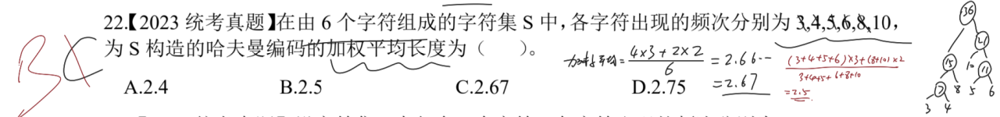
> $WPL = (3 + 4 + 5 + 6) \times 3 + (8 + 10) \times 2 = 90$；
> 另一种算法：$WPL = 7 + 15 + 11 + 21 + 36 = 90$ 
> 则：$加权平均长度 = \frac{WPL}{(3 + 4 + 5 + 6 + 8 + 10)} = 2.5$

> **注意点**：哈夫曼树中，左右孩子的权值之和为父结点权值。
> 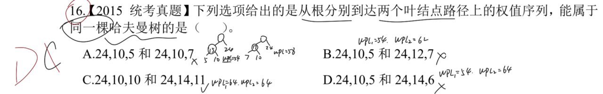
> 这里的四个选项中 `24` 均作为父结点存在。
> 以 A 为例子：*若想要构造左子树中的 10，那么必须另一个叶子节点是 5，此时右子树需要构造需要使用 3。根据哈夫曼树的特点，应该是两个值最小的叶子节点合并，这里 3 应该和 5 合并，但是并没有，故错误。*
>      24
>     / \
>    10    10
>   / \    / \
>  5   *5*  *3*   7
>  其余选项同理。
>  D 项：此时满足哈夫曼树的构造条件。
>      24
>     / \
>    10    14
>   / \    / \
>  5   *5*  *8*   6

---

## 5.2. 前缀编码

> **注意点**：前缀编码的要点是，任意一个编码不能是另一个编码的前缀。其本质是：**从根结点到叶子节点的路径上不能存在其他叶子节点。**
> 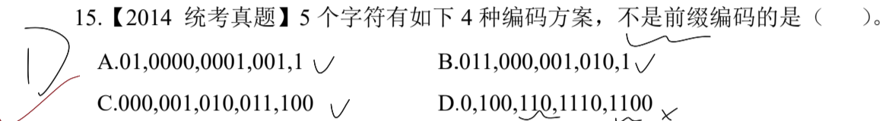
> 这里很明显 D 选项中有 `110` 是 `1100` 的前缀，则不可能是正确的前缀编码。

> **注意点**：从左往右译码，根据每个字符对应的编码即可。
> 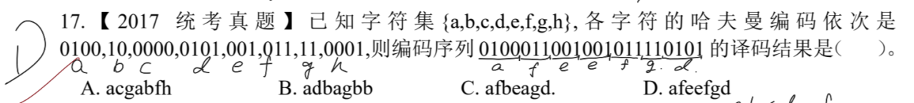

> **注意点**：根据每个字符出现的次数，构造一个哈夫曼树。至于 `0` 和 `1` 分别代表哪边子树不影响整体的效果，只需遵循所有的左/右子树的编码是一致的。
> 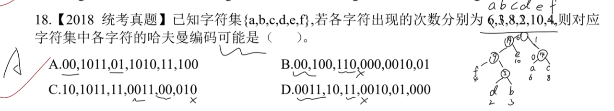
> 这题除了根据构造哈夫曼树来解决问题外，还可以根据前缀编码的特点：**任意前缀编码不能是其他编码的前缀**。因此此题 B、C 两项必定错误。
> **还需额外注意的一点是：一般遵循左小右大的准则，因此构造的时候需要调整位置。**

---

## 5.3. 并查集

> **注意点**：并查集主要考察在大题中。类似于集合的合并操作。
> 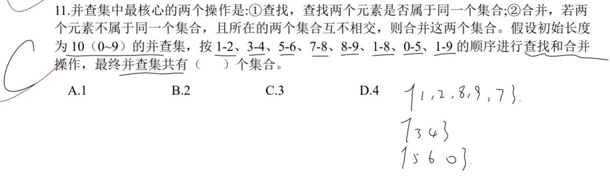

